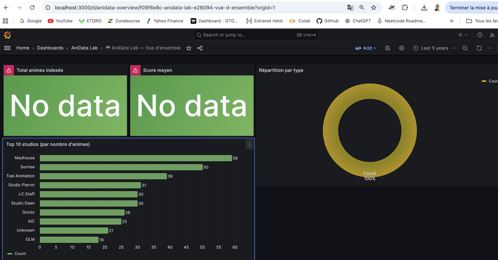

# 🎌 AniData Lab — Pipeline Data Engineering Anime/Manga

Projet de **Data Engineering** et **DataOps** autour des données Anime/Manga.

L’objectif est de construire un pipeline complet permettant de collecter, nettoyer, valider, indexer et visualiser des données Anime/Manga à l’aide d’une architecture moderne basée sur **Python**, **Docker**, **Airflow**, **Elasticsearch** et **Grafana**.

Ce projet montre ma capacité à construire une chaîne data complète, de la donnée brute jusqu’au dashboard final.

---

## 🎯 Objectif du projet

Les données Anime/Manga sont souvent volumineuses, hétérogènes et difficiles à exploiter directement.

Ce projet vise à répondre à la problématique suivante :

> Comment construire un pipeline Data Engineering complet permettant de transformer des données brutes Anime/Manga en données propres, validées, indexées et visualisables ?

Le projet couvre plusieurs étapes clés :

```txt
Données brutes
     ↓
Audit qualité
     ↓
Nettoyage
     ↓
Feature engineering
     ↓
Validation
     ↓
Indexation Elasticsearch
     ↓
Visualisation Grafana
     ↓
Orchestration Airflow
```

---

## 🧠 Problématique Data Engineering

Ce projet permet de travailler sur des problématiques proches d’un environnement professionnel :

- ingestion de données CSV / JSON / XML ;
- nettoyage et transformation de données ;
- validation de la qualité des données ;
- orchestration de tâches avec Airflow ;
- indexation dans Elasticsearch ;
- visualisation dans Grafana ;
- automatisation via Docker et Docker Compose ;
- mise en place d’une CI/CD avec GitHub Actions ;
- publication d’image Docker sur GHCR.

L’objectif n’est pas seulement d’analyser des données, mais de construire une architecture data fiable, reproductible et automatisée.

---

## 🛠️ Stack technique

### Langages & Data

- Python
- Pandas
- NumPy
- Matplotlib
- Seaborn
- JSON
- CSV
- XML

### Data Engineering

- Apache Airflow
- Docker
- Docker Compose
- Elasticsearch
- Logstash
- Grafana
- PostgreSQL

### DevOps / DataOps

- Git
- GitHub
- GitHub Actions
- GHCR — GitHub Container Registry
- Ruff
- Pytest
- CI/CD
- Branch protection

---

## 🏗️ Architecture globale

```txt
                 ┌────────────────────┐
                 │   Données sources   │
                 │ CSV / JSON / XML    │
                 └─────────┬──────────┘
                           │
                           ▼
                 ┌────────────────────┐
                 │   Scripts Python    │
                 │ Audit / Cleaning    │
                 │ Feature Engineering │
                 │ Validation          │
                 └─────────┬──────────┘
                           │
                           ▼
                 ┌────────────────────┐
                 │      Airflow        │
                 │ Orchestration DAGs  │
                 └─────────┬──────────┘
                           │
                           ▼
                 ┌────────────────────┐
                 │  Elasticsearch      │
                 │ Index anime         │
                 └─────────┬──────────┘
                           │
                           ▼
                 ┌────────────────────┐
                 │      Grafana        │
                 │ Dashboards          │
                 └────────────────────┘
```

---

## 📁 Structure du projet

```txt
anidata-lab/
│
├── docker-compose.yml              # Orchestration des services Docker
├── .env.example                    # Exemple de variables d’environnement
├── start.sh                        # Script de démarrage Linux / Mac
├── start.bat                       # Script de démarrage Windows
├── README.md
│
├── data/                           # Données sources et données transformées
│   ├── raw/                        # Données brutes
│   ├── processed/                  # Données nettoyées
│   └── gold/                       # Données finales prêtes à être indexées
│
├── airflow/
│   ├── dags/                       # DAGs Airflow
│   │   └── anidata_full_pipeline_dag.py
│   │
│   ├── scripts/                    # Scripts exécutés par Airflow
│   │   ├── 01_audit_complet.py
│   │   ├── 02_audit_visuel.py
│   │   ├── 03_nettoyage.py
│   │   ├── 04_feature_engineering.py
│   │   ├── 05_validation.py
│   │   └── 06_indexation_elasticsearch.py
│   │
│   └── logs/                       # Logs Airflow
│
├── elk/
│   ├── mapping_anime.json          # Mapping Elasticsearch
│   └── logstash/
│       └── pipeline/
│           └── logstash.conf       # Configuration Logstash
│
├── grafana/
│   ├── provisioning/
│   │   ├── datasources/            # Configuration automatique datasource
│   │   └── dashboards/             # Provisioning dashboards
│   │
│   └── dashboards/
│       └── anidata-overview.json   # Dashboard Grafana
│
├── notebooks/
│   ├── rapport.md                  # Rapport d’analyse
│   ├── rapport_audit.md            # Rapport d’audit qualité
│   ├── rapport_validation.md       # Rapport de validation
│   └── images/                     # Captures Grafana / Airflow / graphiques
│
├── scripts/
│   ├── deploy_airflow_from_ghcr.sh
│   └── run_e2e_airflow_check.sh
│
└── .github/
    └── workflows/
        └── ci-cd.yml               # Pipeline CI/CD GitHub Actions
```

---

## 📊 Données utilisées

Le projet utilise un dataset Anime/Manga contenant des informations sur les animes, leurs scores, genres, types, studios, épisodes et métadonnées associées.

Source utilisée :

- Dataset Kaggle Anime Recommendation Database

Exemples de fichiers :

```txt
anime.csv
rating_complete.csv
anime_with_synopsis.csv
```

Les données sont ensuite transformées pour produire un dataset final exploitable :

```txt
anime_gold.csv
anime_gold.json
```

---

## 🔄 Pipeline de traitement

Le pipeline principal est orchestré avec **Apache Airflow**.

### Étape 1 — Audit complet

Script :

```txt
01_audit_complet.py
```

Objectif :

- analyser la structure du dataset ;
- vérifier les types de données ;
- détecter les valeurs manquantes ;
- détecter les doublons ;
- identifier les incohérences ;
- produire un rapport d’audit.

---

### Étape 2 — Audit visuel

Script :

```txt
02_audit_visuel.py
```

Objectif :

- générer des graphiques d’analyse ;
- visualiser les distributions ;
- analyser les genres les plus fréquents ;
- analyser les studios ;
- produire des graphiques de contrôle qualité.

Exemples de graphiques générés :

```txt
01_score_distribution.png
02_data_types.png
03_top_genres.png
04_top_studios.png
05_type_distribution.png
06_boxplots.png
07_correlation_matrix.png
```

---

### Étape 3 — Nettoyage des données

Script :

```txt
03_nettoyage.py
```

Objectif :

- corriger les valeurs manquantes ;
- harmoniser les formats ;
- supprimer ou traiter les doublons ;
- corriger les types ;
- produire un dataset nettoyé.

Sortie attendue :

```txt
anime_cleaned.csv
```

---

### Étape 4 — Feature Engineering

Script :

```txt
04_feature_engineering.py
```

Objectif :

- créer de nouvelles variables ;
- enrichir le dataset ;
- préparer les données pour l’analyse et l’indexation ;
- améliorer la qualité analytique du dataset.

Exemples de features possibles :

- score catégorisé ;
- nombre de genres ;
- indicateur de popularité ;
- type d’anime ;
- indicateur de complétude.

---

### Étape 5 — Validation

Script :

```txt
05_validation.py
```

Objectif :

- vérifier que les données finales sont cohérentes ;
- contrôler les colonnes obligatoires ;
- vérifier les types ;
- valider les règles métier ;
- produire un rapport de validation.

---

### Étape 6 — Indexation Elasticsearch

Script :

```txt
06_indexation_elasticsearch.py
```

Objectif :

- créer ou mettre à jour l’index Elasticsearch ;
- envoyer les données nettoyées vers Elasticsearch ;
- utiliser un mode incrémental ou upsert ;
- rendre les données disponibles pour Grafana.

Index cible :

```txt
anime
```

---

## 🧩 Orchestration Airflow

Le DAG Airflow permet d’exécuter toutes les étapes dans le bon ordre.

```txt
Audit complet
     ↓
Audit visuel
     ↓
Nettoyage
     ↓
Feature engineering
     ↓
Validation
     ↓
Indexation Elasticsearch
```

Exemple de DAG :

```txt
anidata_full_pipeline_dag.py
```

Fonctionnalités Airflow utilisées :

- planification des tâches ;
- suivi des exécutions ;
- logs par tâche ;
- gestion des dépendances ;
- relance en cas d’erreur ;
- visualisation du pipeline ;
- trigger manuel depuis l’interface.

---

## 📈 Visualisation Grafana

Les données indexées dans Elasticsearch sont visualisées dans Grafana.

### Dashboard principal

Le dashboard permet de suivre :

- le nombre total d’animes indexés ;
- la répartition des types d’animes ;
- les scores moyens ;
- les genres les plus fréquents ;
- les studios les plus présents ;
- les distributions statistiques ;
- les évolutions ou comparaisons principales.

### Services utilisés

| Service | URL locale | Rôle |
|---|---|---|
| Grafana | `http://localhost:3000` | Visualisation |
| Airflow | `http://localhost:8080` | Orchestration |
| Elasticsearch | `http://localhost:9200` | Stockage / indexation |

---

## 🐳 Environnement Docker

Le projet utilise Docker Compose pour lancer l’ensemble des services nécessaires.

Services principaux :

- Elasticsearch
- Grafana
- Airflow Webserver
- Airflow Scheduler
- PostgreSQL
- Logstash

L’objectif est de rendre le projet reproductible facilement sur une autre machine.

---

## 🚀 Installation

### 1. Cloner le repository

```bash
git clone https://github.com/Ethan941/anidata-lab.git
cd anidata-lab
```

---

### 2. Créer le fichier `.env`

Créer un fichier `.env` à partir du fichier `.env.example`.

Exemple :

```env
AIRFLOW_IMAGE=anidata-airflow:local
AIRFLOW_UID=50000
ELASTICSEARCH_HOST=http://elasticsearch:9200
GRAFANA_ADMIN_USER=admin
GRAFANA_ADMIN_PASSWORD=anidata
```

---

### 3. Télécharger les données

Télécharger le dataset Anime Recommendation Database depuis Kaggle, puis placer les fichiers dans le dossier `data/`.

Structure attendue :

```txt
data/
├── anime.csv
├── rating_complete.csv
└── anime_with_synopsis.csv
```

---

### 4. Lancer les services Docker

Sur Linux / Mac :

```bash
chmod +x start.sh
./start.sh
```

Ou directement :

```bash
docker compose up -d
```

Sur Windows :

```bash
start.bat
```

---

### 5. Vérifier les services

```bash
docker compose ps
```

Les services principaux doivent être en statut `Up`.

---

## ▶️ Utilisation

### Lancer le pipeline Airflow

1. Ouvrir Airflow :

```txt
http://localhost:8080
```

2. Se connecter avec les identifiants définis dans le projet.

3. Activer le DAG :

```txt
anidata_full_pipeline
```

4. Cliquer sur **Trigger DAG**.

5. Vérifier que toutes les tâches passent en `success`.

---

### Vérifier Elasticsearch

```bash
curl http://localhost:9200/anime/_count
```

Cette commande permet de vérifier le nombre de documents indexés dans Elasticsearch.

---

### Ouvrir Grafana

```txt
http://localhost:3000
```

Le dashboard doit afficher les données indexées depuis Elasticsearch.

---

## ✅ Résultats attendus

À la fin du pipeline, le projet doit produire :

- un dataset nettoyé ;
- un dataset enrichi ;
- un rapport d’audit ;
- un rapport de validation ;
- des graphiques d’analyse ;
- un index Elasticsearch alimenté ;
- un dashboard Grafana fonctionnel ;
- des logs Airflow exploitables.

Exemples de résultats :

```txt
output/anime_cleaned.csv
output/anime_gold.json
notebooks/rapport_audit.md
notebooks/rapport_validation.md
notebooks/images/audit_charts/
```

---

## 📸 Captures du projet

Ajouter ici les captures du projet.

### Airflow DAG

```md

```

### Tâches Airflow en succès

```md

```

### Dashboard Grafana

```md

```

---

## 🔁 CI/CD avec GitHub Actions

Le projet contient une pipeline CI/CD avec GitHub Actions.

Objectifs :

- vérifier la qualité du code ;
- lancer le lint ;
- exécuter les tests ;
- construire une image Docker Airflow ;
- publier l’image sur GHCR ;
- sécuriser la branche `main`.

### Étapes principales

```txt
Push / Pull Request
        ↓
Lint Python avec Ruff
        ↓
Tests avec Pytest
        ↓
Build Docker
        ↓
Publication GHCR
```

### Image Docker

L’image Airflow peut être publiée sur GitHub Container Registry :

```txt
ghcr.io/<github-username>/anidata-lab-airflow:latest
```

En local, il est possible d’utiliser :

```env
AIRFLOW_IMAGE=anidata-airflow:local
```

---

## 🧪 Validation de bout en bout

Checklist de validation :

- [ ] Docker Compose démarre correctement
- [ ] Airflow Webserver est accessible
- [ ] Airflow Scheduler est actif
- [ ] Elasticsearch répond
- [ ] Grafana est accessible
- [ ] Le DAG Airflow s’exécute sans erreur
- [ ] Les données sont indexées dans Elasticsearch
- [ ] Le dashboard Grafana affiche les données
- [ ] Les tests CI passent
- [ ] L’image Docker est construite correctement

---

## ⚡ Commandes utiles

### Démarrer le projet

```bash
docker compose up -d
```

### Arrêter le projet

```bash
docker compose down
```

### Arrêter et supprimer les volumes

```bash
docker compose down -v
```

### Voir les logs Airflow

```bash
docker compose logs -f airflow-webserver
docker compose logs -f airflow-scheduler
```

### Voir les logs Elasticsearch

```bash
docker compose logs -f elasticsearch
```

### Redémarrer Airflow

```bash
docker compose restart airflow-webserver airflow-scheduler
```

### Vérifier l’index Elasticsearch

```bash
curl http://localhost:9200/anime/_count
```

### Supprimer l’index Elasticsearch

```bash
curl -X DELETE http://localhost:9200/anime
```

---

## 🐛 Dépannage rapide

### Airflow ne démarre pas

```bash
docker compose down
docker compose up airflow-init
docker compose up -d
```

---

### Elasticsearch ne démarre pas sur Linux

```bash
sudo sysctl -w vm.max_map_count=262144
```

---

### Grafana n’affiche pas de données

Vérifier que l’index Elasticsearch contient bien des documents :

```bash
curl http://localhost:9200/anime/_count
```

Si le compteur est à `0`, relancer le DAG Airflow ou l’indexation Elasticsearch.

---

## ✅ Compétences démontrées

Ce projet met en avant des compétences en :

- Data Engineering ;
- DataOps ;
- orchestration de pipeline avec Airflow ;
- conteneurisation avec Docker ;
- automatisation avec Docker Compose ;
- nettoyage et transformation de données avec Python ;
- validation de qualité de données ;
- indexation dans Elasticsearch ;
- création de dashboards Grafana ;
- CI/CD avec GitHub Actions ;
- publication d’image Docker sur GHCR ;
- monitoring et analyse des logs ;
- structuration d’un projet data complet.

---

## 🚀 Améliorations possibles

- Ajouter des tests unitaires plus complets ;
- ajouter une validation avec Great Expectations ;
- ajouter un pipeline dbt ;
- améliorer le dashboard Grafana ;
- ajouter un monitoring des erreurs Airflow ;
- automatiser le déploiement après CI verte ;
- créer une API FastAPI pour exposer les données ;
- ajouter un modèle de recommandation Anime/Manga ;
- déployer le projet sur un serveur cloud ;
- ajouter une documentation technique dans un dossier `docs/`.

---

## 📚 Documentation complémentaire

Pour éviter un README trop long, la documentation détaillée peut être placée dans un dossier `docs/`.

Structure recommandée :

```txt
docs/
├── installation.md
├── architecture.md
├── airflow.md
├── elasticsearch.md
├── grafana.md
├── cicd.md
└── troubleshooting.md
```

---

## 📌 Statut du projet

Projet en cours d’amélioration.

L’objectif est de faire d’AniData Lab un projet complet de **Data Engineering / DataOps**, capable de démontrer la maîtrise d’une architecture data moderne et reproductible.

---

## 👤 Auteur

**Ethan Pandor**  
Étudiant en Bachelor Data & IA à HETIC  
Recherche stage ou alternance en Data Engineering / Data Science / IA appliquée

- GitHub : [Ethan941](https://github.com/Ethan941)
- LinkedIn : Ethan Pandor
