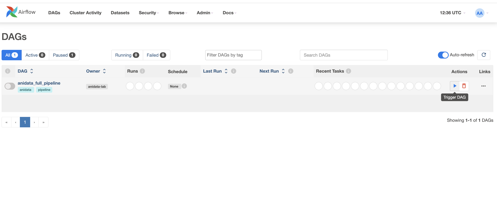
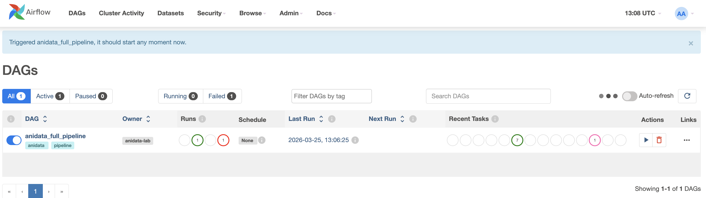
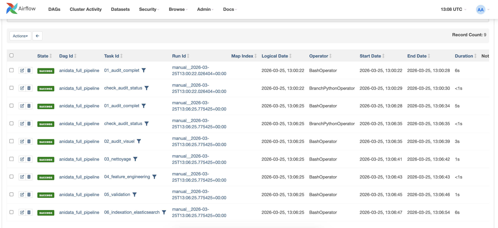
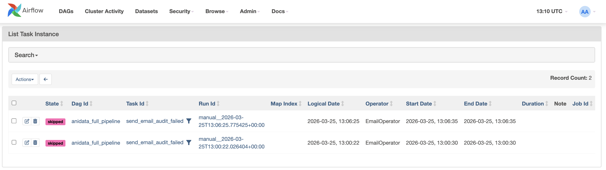
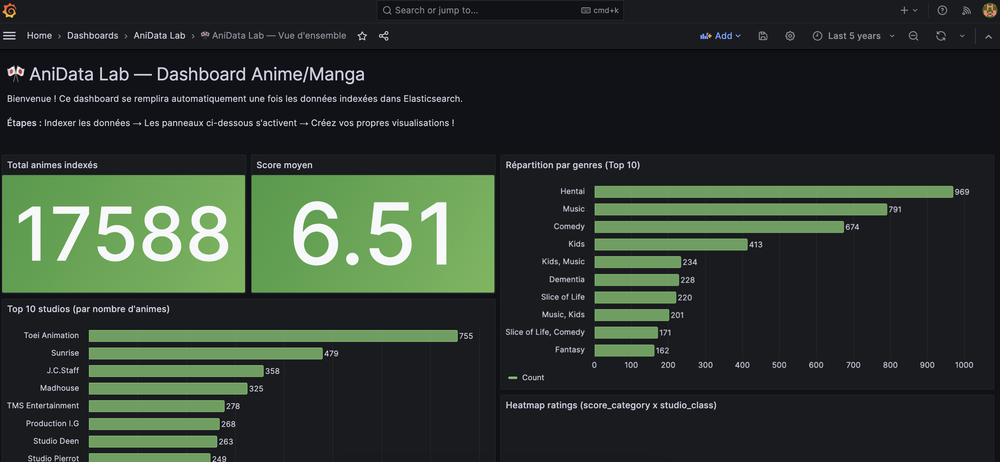
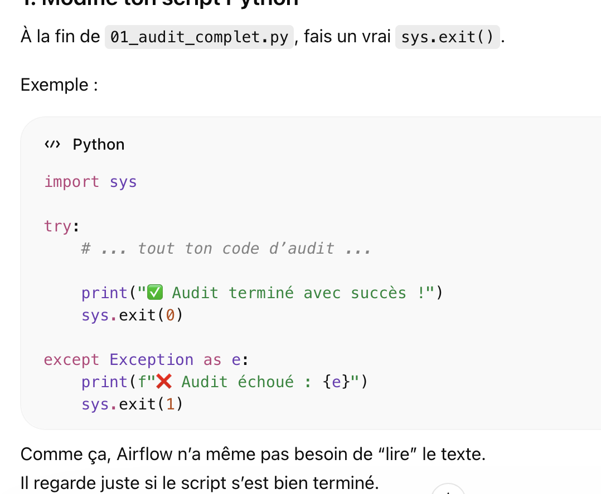

# 🎌 AniData Lab — Observatoire Anime/Manga

> Pipeline de données complet : Data Refinement → Elasticsearch + Grafana → Airflow
> Semaine du 23 au 27 mars 2026

---

## Sommaire
1. **Démarrage rapide**
   - [Prérequis](#prerequis)
   - [Installation (5 minutes)](#installation-5-minutes)
   - [Utilisation au fil de la semaine](#utilisation-au-fil-de-la-semaine)
2. **Comprendre le projet**
   - [Documentation du projet](#documentation-du-projet)
   - [Architecture du projet](#architecture-du-projet)
   - [Consommation mémoire (optimisée pour 8 Go)](#consommation-memoire)
3. **Exploitation & maintenance**
   - [CI GitHub Actions & protection de main](#ci-github-actions--protection-de-main)
   - [Commandes utiles](#commandes-utiles)
   - [Dépannage](#depannage)
     - cas fréquents couverts : Elasticsearch (Linux), Airflow DB init, OOM webserver, Grafana sans données, imports Airflow Cursor, reset complet
   - [Ressources](#ressources)

## 📋 Prérequis

<a id="prerequis"></a>

- **Docker Desktop** installé et lancé ([docker.com/get-started](https://www.docker.com/get-started))
- **VS Code** avec les extensions Python et Jupyter ([code.visualstudio.com](https://code.visualstudio.com/))
- **Python 3.10+** installé en local (pour le Data Refinement)
- **8 Go de RAM minimum** (fermer les applications inutiles)
- **10 Go d'espace disque** disponible

### Extensions VS Code recommandées

```
code --install-extension ms-python.python
code --install-extension ms-toolsai.jupyter
```

### Vérification rapide

```bash
docker --version        # Docker 24+ recommandé
docker compose version  # Docker Compose v2+
python --version        # Python 3.10+
code --version          # VS Code
```

---

## 🚀 Installation (5 minutes)

<a id="installation-5-minutes"></a>

### Étape 1 — Copier le projet

```bash
cd ~/Desktop
unzip anidata-lab.zip && cd anidata-lab
```

### Étape 2 — Installer les dépendances Python locales (optionnel)

Si vous exécutez les scripts uniquement dans Docker, vous pouvez sauter cette étape.
Elle est nécessaire uniquement pour une exécution locale (hors conteneur).

```bash
pip install pandas numpy matplotlib seaborn elasticsearch
```

### Étape 3 — Télécharger les données

1. Aller sur **https://www.kaggle.com/datasets/hernan4444/anime-recommendation-database-2020**
2. Se connecter (compte Kaggle gratuit)
3. Cliquer **Download** et extraire dans le dossier `data/` :

```
data/
├── anime.csv                  (~3 MB)
├── rating_complete.csv        (~700 MB)
└── anime_with_synopsis.csv    (~5 MB)
```

### Étape 4 — Lancer l'environnement Docker

```bash
# Linux / Mac
chmod +x start.sh && ./start.sh

# Windows
start.bat

# Ou directement :
docker compose up -d
```

### Étape 5 — Vérifier que tout fonctionne

| Service           | URL                          | Identifiants         |
|-------------------|------------------------------|----------------------|
| **Grafana**       | http://localhost:3000        | admin / anidata      |
| **Airflow**       | http://localhost:8080        | admin / admin        |
| **Elasticsearch** | http://localhost:9200        | (API directe)        |

### Étape 6 — Ouvrir le projet dans VS Code

```bash
code .
```

Les fichiers Python et notebooks (.ipynb) s'ouvrent directement dans VS Code.

---

## 📘 Documentation du projet

<a id="documentation-du-projet"></a>

- Rapport principal de la semaine : [`notebooks/rapport.md`](notebooks/rapport.md)
- Rapport d'audit détaillé : [`rapport_audit.md`](rapport_audit.md)
- Rapport de validation détaillé : [`rapport_validation.md`](rapport_validation.md)
- Captures associées au rapport : `notebooks/images/`
- Supports de cours : `notebooks/Cours ELK Grafana Mardi.pdf`

---

## 🏗️ Architecture du projet

<a id="architecture-du-projet"></a>

```
anidata-lab/
│
├── docker-compose.yml              # Orchestration des services Docker
├── .env                            # Variables de configuration
├── start.sh / start.bat            # Scripts de démarrage
│
├── data/                           # 📦 Datasets CSV source + gold
│   ├── LIRE_MOI.txt
│   ├── anime.csv
│   ├── rating_complete.csv
│   └── anime_with_synopsis.csv
│   └── gold/
│       ├── anime_gold.csv
│       └── anime_gold.json
│
├── airflow/
│   ├── dags/                       # 🔄 Orchestration Airflow
│   │   └── anidata_full_pipeline_dag.py
│   ├── scripts/                    # Scripts exécutés dans le DAG
│   │   ├── 00_hello_anidata.py
│   │   ├── 01_audit_complet.py
│   │   ├── 02_audit_visuel.py
│   │   ├── 03_nettoyage.py
│   │   ├── 04_feature_engineering.py
│   │   ├── 05_validation.py
│   │   ├── refine_gold_dataset.py
│   │   └── script_prof.py
│   ├── plugins/                   # Optionnel
│   └── logs/                      # Logs Airflow
│
├── elk/
│   ├── mapping_anime.json          # Mapping Elasticsearch
│   └── logstash/
│       └── pipeline/               # Config Logstash
│           └── logstash.conf
│
├── grafana/
│   ├── provisioning/
│   │   ├── datasources/            # Elasticsearch auto-configuré
│   │   └── dashboards/             # Chargement auto des dashboards
│   └── dashboards/                 # 📊 Fichiers JSON des dashboards
│       └── anidata-overview.json   # Dashboard de démarrage
│
└── notebooks/
    ├── rapport.md                  # Rapport consolidé (audit + refinement + ELK)
    ├── rapport_audit.md           # Sorties audit (01_audit_complet)
    ├── rapport_validation.md      # Sorties validation (05_validation)
    ├── images/                     # Captures & graphiques
    │   ├── grafana.png
    │   ├── grafana2.png
    │   ├── airflow_dag.png
    │   └── audit_charts/          # Graphiques générés par 02_audit_visuel
    ├── Cours ELK Grafana Mardi.pdf
    └── Cours ETL Airflow Jour3.pdf
```

---

## 🧮 Consommation mémoire (optimisée pour 8 Go)

<a id="consommation-memoire"></a>

| Service            | RAM allouée | Rôle                              |
|--------------------|-------------|-----------------------------------|
| Elasticsearch      | 1 Go        | Stockage et recherche             |
| Airflow Webserver  | 512 Mo      | Interface web                     |
| Airflow Scheduler  | 512 Mo      | Exécution des DAGs                |
| PostgreSQL         | 256 Mo      | Base de données Airflow           |
| **Grafana**        | **128 Mo**  | **Dashboards (4x moins que Kibana)** |
| Logstash           | 512 Mo      | **À la demande uniquement**       |
| **Total permanent**| **~2,4 Go** | **Reste ~5,6 Go pour l'OS + VS Code** |

---

## 📊 Utilisation au fil de la semaine

<a id="utilisation-au-fil-de-la-semaine"></a>

### Lundi / Mardi matin — Data Refinement (VS Code)

Ouvrir le projet dans VS Code et créer des notebooks dans `notebooks/` :

```python
import pandas as pd
anime = pd.read_csv("data/anime.csv")
anime.head()
```

### Mardi après-midi — Elasticsearch + Grafana

**Indexer via Logstash :**

```bash
docker compose --profile ingest up logstash
# Logstash lit anime.csv et l'indexe dans Elasticsearch
# Attendre la fin, puis Ctrl+C
```

**Indexer via Python (alternative) :**

```python
from elasticsearch import Elasticsearch
es = Elasticsearch("http://localhost:9200")
es.index(index="anime", id=1, document={"name": "Naruto", "score": 8.0})
```

Puis ouvrir **Grafana** http://localhost:3000 (admin / anidata).
Un dashboard de démarrage est déjà pré-configuré !

### Mercredi → Vendredi — Airflow

Ouvrir **Airflow** http://localhost:8080 (admin / admin).
Créer vos DAGs dans `airflow/dags/` — ils apparaissent automatiquement.

### Airflow vs Cron (pour bien comprendre)

Un cron (souvent écrit `cron job`) sur Linux est un système de planification de tâches automatiques.

En gros :
c’est un outil qui permet d’exécuter des commandes ou scripts à des moments précis (toutes les heures, tous les jours, etc.), sans intervention humaine.

Exemple concret :
- lancer un script Python tous les jours à 3h
- faire une sauvegarde toutes les 10 minutes
- envoyer un email tous les lundis

Différence clé :
- `cron` déclenche “à l’heure” une commande.
- `Airflow` orchestre des pipelines (dépendances entre étapes, exécution pilotée, historisation, etc.).

---

## ✅ CI GitHub Actions & protection de main

<a id="ci-github-actions--protection-de-main"></a>

Le workflow `/.github/workflows/ci.yml` automatise les contrôles qualité à chaque
`push` et `pull_request` :

- **Trigger** : `push` + `pull_request`
- **Runner** : `ubuntu-latest`
- **Job** : `lint-test`
- **Steps principales** :
  - checkout du dépôt
  - setup Python 3.11
  - installation des dépendances dev (`requirements-dev.txt`)
  - lint avec `ruff`
  - tests avec `pytest` + couverture (`--cov-fail-under=80`)

Objectif : empêcher l’intégration de changements cassés et garantir un niveau
minimum de qualité avant merge.

### Activer la protection de `main` (PR obligatoire + CI verte)

Dans GitHub :

1. Aller dans **Settings** → **Branches** → **Add branch protection rule**
2. `Branch name pattern` : `main`
3. Cocher **Require a pull request before merging**
4. (Optionnel recommandé) `Require approvals = 1`
5. Cocher **Require status checks to pass before merging**
6. Dans la liste des checks, sélectionner le check CI (après le 1er run), généralement :
   **Lint and Tests (Python 3.11)**
7. Cocher **Require branches to be up to date before merging**
8. Cliquer **Save changes**

---

## ⚡ Commandes utiles

<a id="commandes-utiles"></a>

```bash
# Démarrer tout
docker compose up -d

# (Re)démarrer Airflow + sa DB Postgres
docker compose up -d postgres airflow-init airflow-webserver airflow-scheduler

# Arrêter tout (conserve les données)
docker compose down

# (Re)faire une remise à zéro complète via Airflow
# (arrête les conteneurs et garde les volumes)
# Si tu veux repartire de zéro "clean" : stop/détruit les conteneurs, puis recrée l'environnement.
# Exemple : enchaîner `docker compose down` puis `docker compose up -d`.

# Arrêter et SUPPRIMER toutes les données
docker compose down -v

# (Re)créer l'environnement après destruction complète
docker compose up -d

# Voir les logs d'un service
docker compose logs -f elasticsearch
docker compose logs -f grafana
docker compose logs -f airflow-webserver

# Redémarrer un service
docker compose restart grafana

# Vérifier l'état
docker compose ps

# Lancer Logstash ponctuellement pour indexer
docker compose --profile ingest up logstash

# Installer un package Python dans Airflow
docker compose exec airflow-webserver pip install <package>

# Shell dans un container
docker compose exec airflow-webserver bash
```

---

## 🐛 Dépannage

<a id="depannage"></a>

### Elasticsearch ne démarre pas (Linux)

```bash
sudo sysctl -w vm.max_map_count=262144
echo "vm.max_map_count=262144" | sudo tee -a /etc/sysctl.conf
```

### Airflow "Database not initialized"

```bash
docker compose down
docker compose up airflow-init
docker compose up -d
```

### Airflow UI ne répond pas (ERR_EMPTY_RESPONSE) / `SIGKILL` (OOM) sur `airflow-webserver`

Symptôme typique dans les logs :
`Worker (...) was sent SIGKILL! Perhaps out of memory?`

Modif minimale recommandée dans `docker-compose.yml` (service `airflow-webserver`) :

```yaml
environment:
  - AIRFLOW__CORE__DAGS_ARE_PAUSED_AT_CREATION=${AIRFLOW__CORE__DAGS_ARE_PAUSED_AT_CREATION}
  - AIRFLOW__WEBSERVER__WORKERS=1
  - _PIP_ADDITIONAL_REQUIREMENTS=pandas
```

Puis relancer et retester :

```bash
docker compose down
docker compose up -d
curl http://localhost:8080/health
```

### Grafana ne montre pas de données

1. Vérifier qu'Elasticsearch a des données : `curl http://localhost:9200/anime/_count`
2. Dans Grafana → Configuration → Data Sources → tester la connexion
3. Relancer Logstash si besoin : `docker compose --profile ingest up logstash`

### Les imports Airflow sont soulignés dans Cursor (mais ça marche dans Docker)

 C'est un avertissement de l'IDE (linter `basedpyright`) et pas un vrai problème d'exécution.

- Quand tu exécutes les DAG dans Docker, le conteneur a bien `apache-airflow` installé, donc les imports comme `from airflow.operators.bash import BashOperator` fonctionnent.
- Dans Cursor, le linter analyse ton environnement Python local (ou le venv sélectionné). S'il n'a pas `apache-airflow` installé, Cursor affiche “Impossible de résoudre l'importation …”.

Si tu veux faire disparaître le warning : installe `apache-airflow` dans le même interpréteur Python que celui utilisé par Cursor, ou ignore simplement ces warnings de type.

### Supprimer le DAG Airflow : pourquoi les données restent sur Grafana ?

Si tu supprimes le DAG `anidata_full_pipeline` dans Airflow, tu peux quand même voir les chiffres dans Grafana.

Dans ton projet, la “base de données” qui sert à afficher les chiffres dans Grafana, c’est Elasticsearch.

Explication : le DAG Airflow ne “stocke” pas les données. Il sert uniquement à exécuter tes scripts (notamment `script_prof.py`) qui indexent ensuite les données dans Elasticsearch. Une fois l’index `anime` créé dans Elasticsearch, Grafana continuera d’afficher les résultats tant que l’index (et ses documents) existent.

Pour effacer réellement les données affichées dans Grafana :
1. Supprimer l’index Elasticsearch `anime` :
   `curl -X DELETE http://localhost:9200/anime`
2. Ou réinitialiser Elasticsearch (supprime les volumes) :
   `docker compose down -v && docker compose up -d elasticsearch`

### Indexation Elasticsearch via le DAG (script_prof.py)

Question (dernière) :
`docker compose exec airflow-webserver python /opt/airflow/scripts/script_prof.py`

Réponse :
Oui, tu peux le faire via le DAG. Dans `anidata_full_pipeline`, lance le DAG puis attends que la tâche
`06_indexation_elasticsearch` s’exécute (c’est elle qui lance `script_prof.py` et recrée l’index `anime`).

Question :
L'indexation Elasticsearch est-elle forcément refaite après DAG1 ?

Réponse :
Oui, si `anidata_full_pipeline` va jusqu’à la tâche `06_indexation_elasticsearch`, alors l’indexation est refaite à chaque run de DAG1.

Dans ton DAG :
- `06_indexation_elasticsearch` lance `script_prof.py`
- `script_prof.py` indexe dans `anime` en mode incrémental/upsert
- il ne supprime pas forcément l’index : il met à jour/ajoute selon les IDs

En pratique : c’est `script_prof.py` qui “fabrique” la base de données pour Grafana, c’est-à-dire l’index Elasticsearch `anime` (et donc les documents qui alimentent les dashboards).

Note : `script_prof.py` fait maintenant une **indexation incrémentale / upsert** :
- il ne supprime plus l’index existant `anime`
- les documents sont mis à jour via `_id` (basé sur `mal_id`)

Image (clic pour déclencher le DAG) :


### Résultats DAG Airflow (exécution complète)

- Vue DAG (succès) :
  
- Les 7 tâches principales sont en `success` :
  
- Aucun email d’échec n’a été envoyé (tâche `send_email_audit_failed` en `skipped`) :
  

### DAG2 : pourquoi le total passe de 17562 à 17588

Le panneau Grafana **“Total animes indexés”** compte les documents dans l’index Elasticsearch `anime`.

- Après exécution **DAG1 seul** (indexation depuis `anime_gold.json`) : **17562**.
- Après exécution **DAG2 puis DAG1** :
  - `dag2` convertit `data/anime_2.json` et `data/anime_3.xml` en CSV,
  - puis indexe/upsert ces nouveaux enregistrements directement dans l’index **`anime`**,
  - ce qui ajoute **+26** documents uniques.

Donc : **17562 → 17588 (= 17562 + 26)**.

Pour refaire la demo (17562 puis 17588) :
- Supprime l'index `anime` (vrai reset Elasticsearch) :
  `curl -X DELETE http://localhost:9200/anime`
- Vérifie :
  `curl http://localhost:9200/anime/_count`

Captures :

- DAG1 only :
  
- DAG2 + DAG1 :
  

### `01_audit_complet.py` : `sys.exit()` à la fin

À la fin de `01_audit_complet.py`, il vaut mieux faire un `sys.exit()` pour que le script se termine proprement (succès ou échec).

Exemple :

```python
import sys

try:
    # ... tout ton code d’audit ...

    print("✅ Audit terminé avec succès !")
    sys.exit(0)

except Exception as e:
    print(f"❌ Audit échoué : {e}")
    sys.exit(1)
```

Dans ton cas **Airflow** :

Quand ton script fait :

```python
print("Audit terminé avec succès !")
```

👉 cette phrase est envoyée dans un **stream stdout**.

Et Airflow peut :
- lire ce flux
- ou récupérer tout à la fin via les logs / l’exécution du `BashOperator`.

Exemple visuel (sortie console) :



### Email en cas d'échec (DAG `anidata_full_pipeline_dag.py`)

Dans `anidata_full_pipeline_dag.py`, l’`EmailOperator` envoie l’email à :

- `to="tonmail@example.com"`

Donc c’est **`tonmail@example.com`** (placeholder à remplacer par ton vrai email).

### Où retrouves-tu la phrase dans Airflow ?

Oui, les logs Airflow enregistrent tous les `print()`, donc :

SI ton script affiche

```python
print("Audit terminé avec succès !")
```

👉 alors oui, cette phrase sera dans les logs Airflow ✅

🧠 1. Où ça apparaît ?

Dans Airflow :
`UI → ton DAG → tâche 01_audit_complet → onglet Log`

Tu verras exactement la ligne
`Audit terminé avec succès !`
dans la sortie de la tâche.

🧠 2. Comment le DAG la détecte ?

Dans `anidata_full_pipeline_dag.py`, la commande de `01_audit_complet` écrit d’abord la console dans :
`/opt/airflow/output/audit_log.txt` (via `tee`)

Puis le DAG vérifie :
`if grep -q 'Audit terminé avec succès !' /opt/airflow/output/audit_log.txt; then ...`

### Pourquoi `anidata_full_pipeline` peut échouer même si l’audit affiche "✅ Audit terminé…"

Cas typique :
`01_audit_complet.py` affiche bien “✅ Audit terminé…” donc le `grep` passe, **mais** la tâche échoue quand même car le `BashOperator` faisait un **test de déterminisme** en comparant le hash de `audit_log_1.txt` et `audit_log_2.txt`.

Si les logs diffèrent (même 1 ligne), ça force `FAIL` et `exit 1`.

Extrait (ancienne logique) :

```bash
"grep -q 'Audit terminé avec succès !' /opt/airflow/output/audit_log_1.txt || (echo FAIL > /opt/airflow/output/audit_status.txt; exit 1); "
"hash1=$(sha256sum /opt/airflow/output/audit_log_1.txt | awk '{print $1}'); "
# Run 2
"grep -q 'Audit terminé avec succès !' /opt/airflow/output/audit_log_2.txt || (echo FAIL > /opt/airflow/output/audit_status.txt; exit 1); "
"hash2=$(sha256sum /opt/airflow/output/audit_log_2.txt | awk '{print $1}'); "
# Compare
"if [ \"$hash1\" != \"$hash2\" ]; then echo FAIL > /opt/airflow/output/audit_status.txt; exit 1; fi; "
```

Pourquoi ça arrive :
le script imprime des choses qui peuvent varier d’un run à l’autre (timestamps, ordre d’affichage, etc.), donc les 2 logs ne sont pas forcément strictement identiques.

#### Correction appliquée

Le DAG a été modifié pour **ne plus faire échouer le run sur un hash mismatch** :
- on garde les 2 exécutions,
- on garde le `grep "Audit terminé avec succès !"`,
- on garde la 2e exécution comme log canonique (`audit_log.txt`) et on écrit `OK`.

#### Après modification (recharger Airflow)

```bash
docker compose restart airflow-scheduler airflow-webserver
```

### run2 : ce que fait `02_audit_visuel.py` dans `anidata_full_pipeline_dag.py`

Le DAG exécute `run_02_audit_visuel` (tâche Airflow `02_audit_visuel`) et fait ces vérifications :

1) Lance le script :
`python /opt/airflow/scripts/02_audit_visuel.py`

2) Sauvegarde la sortie dans un log :
`/opt/airflow/output/audit_visuel_log.txt` (via `tee`)

3) Vérifie que Python s’est bien terminé (code retour != 0 => `FAIL`)

4) Compte les `.png` générés dans :
`/opt/airflow/output/audit_charts/`
Attendu : **7 fichiers**

5) Met `OK` ou `FAIL` dans :
`/opt/airflow/output/audit_visuel_status.txt`

6) Vérifie les noms exacts des fichiers (7 attendus) :
- `01_score_distribution.png`
- `02_data_types.png`
- `03_top_genres.png`
- `04_top_studios.png`
- `05_type_distribution.png`
- `06_boxplots.png`
- `07_correlation_matrix.png`

### run_03_nettoyage : ce que fait `03_nettoyage.py` dans `anidata_full_pipeline_dag.py`

Le DAG exécute `run_03_nettoyage` (tâche Airflow `03_nettoyage`) et attend principalement ces vérifications :

Ce que cette version vérifie :

- le script ne crash pas (exit code OK)
- `output/anime_cleaned.csv` a bien été généré
- le fichier n’est pas vide
- le log contient bien la ligne `Nettoyage terminé !`

1) Lancer le script :
`python /opt/airflow/scripts/03_nettoyage.py`

2) Sauver le log d’exécution (stdout) dans les logs Airflow (onglet **Log** de la tâche).

3) Vérifier que le script s’est bien terminé (exit code OK => la tâche passe, sinon FAIL).

4) Vérifier que le fichier existe vraiment :
`/opt/airflow/output/anime_cleaned.csv`

5) Vérifier que le fichier n’est pas vide.

6) Éventuellement vérifier que le fichier contient bien les colonnes attendues (ex : `mal_id`, `name`, `score`, `episodes`, etc.).

### Un port est déjà utilisé

```bash
lsof -i :3000   # ou 9200, 8080
```

### Réinitialisation complète

```bash
docker compose down -v
docker compose up -d
```

---

## 📚 Ressources

<a id="ressources"></a>

- [Dataset Kaggle](https://www.kaggle.com/datasets/hernan4444/anime-recommendation-database-2020)
- [Documentation Elasticsearch](https://www.elastic.co/guide/en/elasticsearch/reference/current/index.html)
- [Documentation Grafana](https://grafana.com/docs/grafana/latest/)
- [Documentation Airflow](https://airflow.apache.org/docs/apache-airflow/stable/)
- [Pandas Documentation](https://pandas.pydata.org/docs/)
