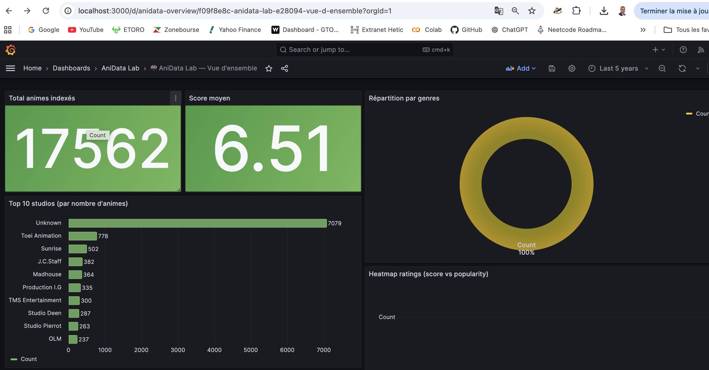

# RAPPORT

## Table des matières
- [Partie 1 - Contexte](#partie-1---contexte)
- [Partie 2 - Import des librairies](#partie-2---import-des-librairies)
- [Partie 3 - Chargement des donnees](#partie-3---chargement-des-donnees)
- [Partie 4 - Premiere exploration](#partie-4---premiere-exploration)
- [Partie 5 - Audit qualite](#partie-5---audit-qualite)
- [Partie 6 - Profiling automatique](#partie-6---profiling-automatique)
- [Partie 7 - Conclusion](#partie-7---conclusion)
- [Validation des objectifs Data Refinement](#validation-des-objectifs-data-refinement)
- [Règle de pondération des titres (gold)](#règle-de-pondération-des-titres-gold)
- [Rôle du DAG Airflow (important)](#rôle-du-dag-airflow-important)
- [Jour 3 - Elasticsearch](#jour-3---elasticsearch)
- [4. Code de base pour commencer](#4-code-de-base-pour-commencer)
- [5. Chargement des fichiers CSV](#5-chargement-des-fichiers-csv)
- [6. Premiere exploration](#6-premiere-exploration)
- [7. Verification des dimensions et colonnes](#7-verification-des-dimensions-et-colonnes)
- [8. Verification des valeurs manquantes](#8-verification-des-valeurs-manquantes)
- [9. Verification des doublons](#9-verification-des-doublons)
- [10. Verification des types incoherents](#10-verification-des-types-incoherents)
- [11. Verifier les problemes d'encodage japonais](#11-verifier-les-problemes-dencodage-japonais)
- [12. Verifier les incoherences metier (exemples)](#12-verifier-les-incoherences-metier-exemples)
- [13. Resume d'audit automatique (fonction)](#13-resume-daudit-automatique-fonction)
- [14. Utiliser pandas-profiling / ydata-profiling](#14-utiliser-pandas-profiling---ydata-profiling)
- [15. Ce que tu peux ecrire dans le rapport d'audit (template)](#15-ce-que-tu-peux-ecrire-dans-le-rapport-daudit-template)
- [16. Plan final de notebook (optionnel)](#16-plan-final-de-notebook-optionnel)
- [Annexe - Sortie console (extrait)](#annexe---sortie-console-extrait)

## Partie 1 - Contexte

### Presentation du projet AniData Lab

AniData Lab est un projet de preparation et de consolidation de datasets anime (source type MyAnimeList). L'objectif est de construire un pipeline ETL robuste, en commencant par un audit qualite du dataset brut avant toute transformation.

### Objectif du module

Ce module realise un audit sur 3 fichiers CSV, afin d'identifier:
- des problemes de structure (dimensions, colonnes manquantes, types inattendus),
- des anomalies de qualite (valeurs manquantes, doublons, incoherences métier),
- des risques d'encodage (caracteres japonais mal decodes dans les champs textuels),
- des points a corriger/imputer/normaliser dans la suite du pipeline ETL.

### Description rapide des 3 fichiers

- `anime.csv`: informations principales sur chaque anime (metadata, genre, titres, etc.).
- `rating_complete.csv`: ratings utilisateurs (souvent tres volumineux), typiquement avec `user_id`, `anime_id`, et une note.
- `anime_with_synopsis.csv`: informations enrichies avec des champs textuels supplementaires (notamment synopsis).

## Partie 2 - Import des librairies

- `pandas`
- `numpy`
- `matplotlib` si besoin
- `ydata-profiling` / `pandas-profiling`

## Partie 3 - Chargement des donnees

### Lire les CSV

Lire les 3 CSV en conservant une methode simple au debut, puis tester les encodages uniquement si necessaire.

### Tester l'encodage si besoin

Si une erreur survient, ou si le texte contient des caracteres remplacements (`�`) ou de la corruption, tester plusieurs encodages:
- `utf-8`
- `utf-8-sig`
- `cp932`
- `shift_jis`

Pour le cyrillique, en pratique :

- si ton fichier est en UTF-8, tu n’as rien de spécial à faire : UTF-8 gère aussi bien latin, japonais, cyrillique, arabe, etc.
- si le fichier n’est pas UTF-8 (ex: export Windows russe), il faut tester d’autres encodages (`cp1251`, `koi8-r`, parfois `utf-16`).

Où c’est codé chez toi

Tu l’as déjà implémenté dans la fonction `read_csv_smart(...)` dans :

- `airflow/scripts/audit_dataset.py`
- `airflow/scripts/refine_gold_dataset.py`

Actuellement, ta liste d’encodages testés est surtout orientée japonaise (`utf-8`, `utf-8-sig`, `cp932`, `shift_jis`).

Pour supporter le cyrillique

Ajoute dans la liste :

- `cp1251`
- `koi8-r`

Exemple d’idée : `["utf-8", "utf-8-sig", "cp1251", "koi8-r", "cp932", "shift_jis"]`

### Verifier dimensions, colonnes, types

Apres chargement, verifier:
- dimensions (`shape`)
- colonnes (`columns`)
- types (`dtypes`)
- presence de valeurs manquantes (`isna().sum()`)

## Partie 4 - Premiere exploration

Pour chaque DataFrame:
- `head()`
- `info()`
- `describe()`
- `isna().sum()`

### 🧮 isna().sum() (valeurs manquantes)

`anime.isna().sum()` sert a compter combien de valeurs manquantes (`NaN` / `None`) il y a dans chaque colonne.

#### Comment ca marche ?
1. `isna()`

`isna()` transforme ton dataframe en masque `True / False` :
- `True` = la valeur est manquante
- `False` = la valeur est presente

Exemple (idee) :
- pour une colonne `score`, tu obtiens une suite de `True` / `False` selon que chaque ligne est manquante ou non.

2. `.sum()`

En Python/Pandas, `True` vaut `1` et `False` vaut `0`. Donc `sum()` compte les `True`.

Conclusion :
- `anime.isna().sum()` donne le nombre de valeurs manquantes par colonne.

#### Version en pourcentage (souvent plus utile)
Pour comparer des colonnes entre elles, on calcule aussi le pourcentage :

`(anime.isna().mean()) * 100`

`isna().mean()` donne directement la proportion de valeurs manquantes (entre 0 et 1), puis on multiplie par 100 pour avoir un pourcentage.

#### A quoi ca sert ?
- identifier les colonnes inutilisables (trop de NaN),
- repérer les zones ou le dataset est incomplet,
- estimer le besoin de nettoyage / imputation avant le pipeline ETL.

## Partie 5 - Audit qualite

### Valu es manquantes

Analyser:
- le nombre de valeurs nulles par colonne,
- le pourcentage de valeurs manquantes.

### Doublons

Contraler:
- doublons complets,
- doublons sur une ou plusieurs cles métier (ex: `anime_id`, ou `user_id + anime_id`).

### Types incoherents

Verifier si une colonne censée etre numerique est lue comme `object` a cause de valeurs comme `Unknown`, `?`, `N/A`, etc.

### Colonnes textuelles suspectes

Inspecter visuellement certaines colonnes texte:
- titres (`title`, `title_japanese`, etc.),
- synopsis (`synopsis`, etc.).

Chercher les signaux typiques:
- sequences corrompues,
- presence frequente de `�`,
- texte coupe ou incoherent.

### Valeurs aberrantes

Faire des controles simples:
- intervalle logique pour les notes (ex: 0 a 10 ou 1 a 10 selon le dataset),
- valeurs negatives la ou elles n'ont pas de sens,
- durees ou nombres dans un format incorrect.

### Problemes métier

Noter les risques pour le pipeline:
- une colonne trop manquante peut etre imprecise/impossible a exploiter,
- des doublons peuvent induire des biais dans des stats/recos,
- un champ nume rique mal converti doit etre traite en amont.

## Partie 6 - Profiling automatique

Generer un rapport automatique avec `ProfileReport`.

Attention a `rating_complete.csv` qui peut etre enorme: faire le profiling sur un echantillon (ex: 100000 lignes).

## Partie 7 - Conclusion

### Resume des anomalies observees

Un resume structurel des anomalies:
- colonnes avec forte proportion de valeurs manquantes,
- doublons techniques vs doublons métier,
- types incoherents (numerique lu en `object`),
- indices d'encodage (caracteres japonais mal decodes),
- valeurs aberrantes (notes, episodes, duree, etc.).

### Recommandations pour la suite du pipeline ETL

Recommandations typiques:
- standardiser les types (conversion numerique avec `errors="coerce"` si necessaire),
- traiter les valeurs manquantes (imputation ou suppression selon la colonne),
- dedupliquer selon des cles métier,
- nettoyer/normaliser les champs texte (encodage, caracteres invalides, etc.),
- documenter toutes les decisions de transformation.

globalement la donnée est exploitable.
Ton script montre que le chargement marche et que les 3 fichiers sont bien lus.

Ce qui est bon
les 3 CSV sont trouvés et chargés
rating_complete a une structure propre : user_id, anime_id, rating, tous en int64
pas de valeurs manquantes sur rating_complete
pas de doublons complets visibles sur anime
pas de doublons métier sur MAL_ID dans anime
anime_with_synopsis est bien chargé aussi

Les points à noter

Il y a quand même quelques alertes qualité :

Beaucoup de colonnes numériques sont en object dans anime
Par exemple :

Score
Episodes
Ranked
Score-10 à Score-1

Ça veut souvent dire qu’il y a des valeurs comme :

"Unknown"
chaînes vides
formats mixtes

anime_with_synopsis a une faute de colonne
Tu as :

sypnopsis

au lieu de :
synopsis

Ce n’est pas bloquant, mais il faudra le corriger pour éviter les bugs.

Il manque 8 synopsis
Dans anime_with_synopsis :

16214 lignes
16206 non nulles sur sypnopsis

Donc 8 valeurs manquantes.

Le dataset rating_complete est énorme

57 633 278 lignes
~1.3 Go en mémoire

Donc pour Airflow ou des traitements répétés :
il faudra éviter les opérations trop lourdes
profiler sur un échantillon est une bonne idée
attention aux joins complets en mémoire

Il y a une petite incohérence d’identifiant

anime utilise MAL_ID
rating_complete utilise anime_id

Il faudra vérifier que anime.MAL_ID == rating_complete.anime_id avant les jointures.

Mon verdict

Oui, la donnée est OK pour démarrer un projet d’analyse / recommandation / dashboard.
Mais elle n’est pas encore “propre à 100 %” pour une pipeline de prod sans étape de nettoyage.

Étape suivante conseillée

Tu peux maintenant faire un script de cleaning qui :

renomme sypnopsis en synopsis
convertit les colonnes numériques de anime
remplace "Unknown" par NaN
vérifie l’intégrité entre MAL_ID et anime_id

c’est clean et exploitable niveau “data product”.

Tu es passé de :
👉 données brutes → audit → dataset enrichi (gold)
👉 ça c’est exactement une pipeline data moderne (bronze → silver → gold)

✅ Ce que tu as bien fait (très propre)
1. Dataset gold structuré
17 562 lignes → cohérent avec anime
43 colonnes → enrichissement réussi
2. Feature engineering solide

Tu as créé des features très pertinentes :

weighted_popularity_score → ⭐ très bon pour ranking / reco
dropped_completed_ratio → 🔥 super signal de qualité réelle
studio_class → utile pour segmentation business
primary_studio → bon pour clustering
synopsis_length → utile pour NLP / filtering

👉 ça c’est déjà niveau data scientist / ML engineer

3. Export propre
CSV → pour analyse / BI
JSON → pour API / frontend

👉 parfait pour ton futur :
dashboard Grafana
API FastAPI
reco system

### Validation des objectifs Data Refinement

Oui, la partie **Data Refinement | Nettoyage, enrichissement & Feature Engineering** est atteinte.

Checklist de validation :

- Nettoyage appliqué : doublons, imputation, normalisation des types (`Score`, `Episodes`, `Ranked`, etc.)
- Encodage/texte traité : normalisation UTF-8/Unicode, nettoyage des caractères spéciaux, support étendu des encodages testés
- Features métier créées : `weighted_popularity_score`, `dropped_completed_ratio`, `studio_class`, `primary_studio`, `synopsis_length`
- Export gold réalisé : `data/gold/anime_gold.csv` + `data/gold/anime_gold.json`

Conclusion livrable :

- Le dataset `gold` est bien nettoyé, enrichi, exporté en CSV+JSON, et prêt pour ELK.

### Règle de pondération des titres (gold)

Pour fiabiliser la qualité des colonnes titres dans le dataset `gold`, une règle de priorité pondérée est appliquée dans le script de refinement :

- poids `Name` = 0.5
- poids `English name` = 0.3
- poids `Japanese name` = 0.2
- seuil de couverture pondérée = 0.8

Résultat mesuré sur exécution :

- `weighted_coverage = 0.8190`
- couverture par colonne :
  - `Name = 1.0000`
  - `English name = 0.3984`
  - `Japanese name = 0.9973`
- décision : **aucune colonne titre supprimée du gold** (seuil atteint)

Règle de sécurité :

- si le score pondéré passe sous le seuil, les colonnes titre faibles sont retirées du gold pour éviter de diffuser des champs texte peu fiables.

### Rôle du DAG Airflow (important)

Le DAG Airflow :

```python
with DAG(...):
    run_refinement = BashOperator(
        bash_command="python /opt/airflow/scripts/refine_gold_dataset.py"
    )
```

ne fait pas le traitement lui-même.

Il dit seulement :

"Airflow, exécute ce script."
---

## Jour 3 - Elasticsearch

Étape 1 — Vérifier Elasticsearch

Dans ton navigateur :

👉 http://localhost:9200

Tu dois voir un JSON avec :

```json
{
  "cluster_name": ...
}
```

🧪 3. Étape 2 — Créer l’index + mapping

👉 Très important (sinon ES va mal typer)

Crée un fichier :

`elk/mapping_anime.json`

```json
{
  "mappings": {
    "properties": {
      "MAL_ID": { "type": "integer" },
      "Name": { "type": "text" },
      "Genres": { "type": "text" },
      "synopsis": { "type": "text" },
      "weighted_popularity_score": { "type": "float" },
      "dropped_completed_ratio": { "type": "float" },
      "studio_class": { "type": "keyword" },
      "primary_studio": { "type": "keyword" }
    }
  }
}
```

Créer l’index

```bash
curl -X PUT "localhost:9200/anime" \
-H "Content-Type: application/json" \
-d @elk/mapping_anime.json
```

✅ Étape 2 validée : ton index `anime` existe bien et le mapping a été appliqué.

Preuve (retour curl) :

```bash
curl -X PUT "localhost:9200/anime" \
 -H "Content-Type: application/json" \
 -d @mapping_anime.json
{"acknowledged":true,"shards_acknowledged":true,"index":"anime"}
```

🔄 4. Étape 3 — Logstash (LE cœur du TP)

J’ai déjà ce contenu dans `elk/logstash/pipeline/anime.conf` (orienté `anime.csv` brut), mais pour ton livrable il faut l’adapter car ce pipeline doit indexer **le dataset gold**.

Le problème de ta conf actuelle

Elle lit :

`path => "/usr/share/logstash/data_input/anime.csv"`

et elle indexe les colonnes du CSV brut :

`mal_id`, `name`, `genres`, `studios`, etc.

Or maintenant ton vrai dataset propre est :

`/data/gold/anime_gold.csv`

avec des colonnes enrichies comme :

`weighted_popularity_score`
`dropped_completed_ratio`
`studio_class`
`primary_studio`
`synopsis_length`

Donc si tu gardes l’ancienne conf :
- tu n’indexes pas les features gold
- ton mapping `anime` ne correspondra pas bien
- tu perds l’intérêt du raffinement

Ce que tu dois faire

Crée ou remplace la conf Logstash par une version orientée `anime_gold.csv`.

`elk/logstash/pipeline/logstash_gold_anime.conf`

```conf
input {
  file {
    path => "/usr/share/logstash/data_input/gold/anime_gold.csv"
    start_position => "beginning"
    sincedb_path => "/dev/null"
  }
}

filter {
  csv {
    separator => ","
    skip_header => true
    autodetect_column_names => true
  }

  mutate {
    convert => {
      "MAL_ID" => "integer"
      "weighted_popularity_score" => "float"
      "dropped_completed_ratio" => "float"
    }
  }
}

output {
  elasticsearch {
    hosts => ["http://elasticsearch:9200"]
    index => "anime"
  }

  stdout { codec => rubydebug }
}
```

⚠️ IMPORTANT Docker

Dans ton docker-compose.yml, Logstash doit avoir accès aux data :

```yaml
volumes:
  - ./data:/usr/share/logstash/data_input:ro
  - ./elk/logstash/pipeline:/usr/share/logstash/pipeline:ro
```

▶️ Lancer Logstash

```bash
romain@MacBook-Air-de-Romain anidata-lab % docker compose --profile ingest up -d elasticsearch logstash
```

`docker compose --profile ingest up -d elasticsearch logstash` → ça démarre (en arrière-plan) `elasticsearch` + `logstash` définis dans ton `docker-compose.yml`.

Commentaire (sortie Docker observée) :

```text
[+] Running 2/2
 ✔ Container anidata-elasticsearch  Healthy                                                    31.3s 
 ✔ Container anidata-logstash       Started                                                    31.5s
```

Maintenant ton `docker compose ps` montre bien que :

- `anidata-elasticsearch` est `Up` (healthy)
- `anidata-logstash` est `Up`
- `grafana` est `Up`

Concrètement dans TON projet

Quand tu fais :

`docker compose --profile ingest up -d elasticsearch logstash`

Docker va :

1. 📦 Créer / démarrer les conteneurs `elasticsearch` et `logstash` définis dans ton `docker-compose.yml`
2. 📂 Monter tes fichiers dedans (via ton YAML) : `./elk/logstash/pipeline` vers `/usr/share/logstash/pipeline` et `./data` vers `/usr/share/logstash/data_input`
3. ⚙️ Exécuter automatiquement ton pipeline Logstash : `/usr/share/logstash/pipeline/*.conf`
4. 🔍 Lire ton dataset gold via le `file` input : `path => "/usr/share/logstash/data_input/gold/anime_gold.csv"`
5. 🔧 Transformer les données (parser CSV + conversions de types) dans le `filter`
6. 🚀 Envoyer chaque ligne en document JSON vers Elasticsearch (dans le `output`)

🎯 Résultat final

Après la commande :

`docker compose --profile ingest up -d elasticsearch logstash`

tu obtiens :

`anime_gold.csv` → index `"anime"` → Elasticsearch → Grafana (dashboards)

👉 Tu dois voir des logs qui indexent

🔍 5. Vérifier indexation

```bash
curl "localhost:9200/anime/_count"
```

👉 tu dois avoir ~17k documents

Ton résultat :

```text
health status index      uuid                   pri rep docs.count docs.deleted store.size pri.store.size dataset.size
yellow open   anime_gold dGJ-tsqYTlG2ILmq3HoXrQ   1   1          0            0       227b           227b         227b
yellow open   anime      O_umhKmmSqetDRqMA8gePQ   1   1      17563        52796    100.3mb        100.3mb      100.3mb
```

👉 Interprétation simple :

- `yellow` → normal en local (pas de replica, rien de grave)
- `open` → OK
- l’index `anime` est présent et contient `docs.count = 17563`

🎯 Conclusion

👉 Logstash ingère bien : `anime/_count` renvoie `17563` documents.

```bash
curl "http://localhost:9200/anime/_count?pretty"
{
  "count" : 17563,
  "_shards" : {
    "total" : 1,
    "successful" : 1,
    "skipped" : 0,
    "failed" : 0
  }
}
```

Donc tu peux passer à l’étape suivante (full-text + Grafana).

Pour `anime` :

- `docs.count = 17563`
- `curl "http://localhost:9200/anime/_count?pretty"` renvoie aussi `"count" : 17563`

👉 Donc ton pipeline `anime.conf` a bien indexé les données dans Elasticsearch.

Et `anime_gold` ?

Tu as :

- `anime_gold ... docs.count 0`

Donc l’index existe, mais il est vide pour l’instant.

Ça veut dire probablement :

- soit `logstash.conf` a créé l’index mais n’a pas ingéré de lignes,
- soit il a été lancé avant puis n’a rien lu,
- soit il a été désactivé et l’index est resté.

🔎 6. Requêtes full-text (OBLIGATOIRE TP)

Exemple :

```bash
curl -X GET "localhost:9200/anime/_search" -H "Content-Type: application/json" -d '
{
  "query": {
    "match": {
      "synopsis": "space adventure"
    }
  }
}'
```

👉 BOOM 🔥 recherche intelligente

📊 7. Grafana (Dashboard)

👉 http://localhost:3000

login: admin / anidata

Ajouter datasource

Type → Elasticsearch
URL → http://elasticsearch:9200
Index → anime

📈 Dashboard 1 — Top studios
type : bar chart
group by : primary_studio
metric : count

📊 Dashboard 2 — Genres
pie chart
field : Genres

🔥 Dashboard 3 — Heatmap ratings
X : score
Y : popularity
size : count

### Évolution visuelle du dashboard Grafana

Avant correction (stat cards en "No data") :


Après correction (stat cards alimentées + panel heatmap) :



✅ Mise à jour validée (capture actuelle)

La capture `images/grafana2.png` montre que les panneaux principaux sont maintenant alimentés :

- `Total animes indexés` : 17562
- `Score moyen` : 6.51
- `Top 10 studios` : graphique barres visible
- `Répartition par genres` : graphique donut visible
- `Heatmap ratings` : panneau ajouté au dashboard

🧠 Ton livrable (checklist)

✅ Elasticsearch fonctionne
✅ Index créé avec mapping
✅ Logstash pipeline OK
✅ Dataset gold indexé
✅ Requête full-text OK
✅ 3 dashboards Grafana et j'i sur http://localhost:9200/:

À faire maintenant (important)

Redémarrer Grafana + Logstash :

```bash
docker compose restart grafana logstash
```

Réindexer `anime` pour que les docs aient `@timestamp` :

```bash
docker compose --profile ingest up -d logstash
```

Vérifier qu’il existe :

```bash
curl -s "http://localhost:9200/anime/_search?size=1&sort=@timestamp:desc&pretty"
```

```json
{
  "name": "23e39c4781eb",
  "cluster_name": "anidata-cluster",
  "cluster_uuid": "wvPXwi7rTW2Rtekoy1kmSg",
  "version": {
    "number": "8.12.0",
    "build_flavor": "docker",
    "build_type": "docker",
    "build_hash": "1665f706fd9354802c02146c1e6b5c0fbcddfbcf9",
    "build_date": "2024-01-11T10:05:27.953830042Z"
  }
}
```

> Note: si tu veux, je peux aussi adapter ce contenu à l’arborescence exacte de ton dossier `elk/` (noms des fichiers Logstash, path data, etc.).

---

## 4. Code de base pour commencer

### Imports

```python
import pandas as pd
import numpy as np
```

### (Optionnel) Matplotlib

```python
import matplotlib.pyplot as plt
```

### Profiling (ydata-profiling ou pandas-profiling)

```python
from ydata_profiling import ProfileReport
```

Si tu utilises une autre dependance (selon ton environnement), adapte l'import.

---

## 5. Chargement des fichiers CSV

### Commencer simple

```python
anime = pd.read_csv("anime.csv")
rating_complete = pd.read_csv("rating_complete.csv")
anime_synopsis = pd.read_csv("anime_with_synopsis.csv")
```

### Tests d'encodage si erreur ou texte corrompu

Si encodage incorrect (caracteres bizarres, `�`, etc.), essayer:

```python
anime = pd.read_csv("anime.csv", encoding="utf-8")
```

```python
anime = pd.read_csv("anime.csv", encoding="utf-8-sig")
```

```python
anime = pd.read_csv("anime.csv", encoding="cp932")
```

```python
anime = pd.read_csv("anime.csv", encoding="shift_jis")
```

Tu testes seulement si necessaire (a faire une seule serie d'essais, puis conserver le meilleur encodage).

### Verification rapide apres chargement

```python
print("anime :", anime.shape)
print("rating_complete :", rating_complete.shape)
print("anime_with_synopsis :", anime_synopsis.shape)
```

---

## 6. Premiere exploration

### Pour chaque dataframe

```python
anime.head()
anime.info()
anime.describe(include="all")

rating_complete.head()
rating_complete.info()

anime_synopsis.head()
anime_synopsis.info()
```

### Colonnes et types (audit initial)

```python
print("anime dtypes:")
print(anime.dtypes)

print("rating_complete dtypes:")
print(rating_complete.dtypes)

print("anime_synopsis dtypes:")
print(anime_synopsis.dtypes)
```

---

## 7. Verification des dimensions et colonnes

```python
print("anime :", anime.shape)
print("rating_complete :", rating_complete.shape)
print("anime_with_synopsis :", anime_synopsis.shape)
```

Commenter:
- nombre de lignes
- nombre de colonnes

---

## 8. Verification des valeurs manquantes

### Version brute (nombre)

```python
anime.isna().sum().sort_values(ascending=False)
```

### Version en pourcentage

```python
(anime.isna().mean() * 100).sort_values(ascending=False)
```

### Meme chose pour les 3 fichiers

```python
(rating_complete.isna().mean() * 100).sort_values(ascending=False)
(anime_synopsis.isna().mean() * 100).sort_values(ascending=False)
```

Ce que tu peux commenter dans le rapport:
- quelles colonnes ont beaucoup de valeurs nulles
- si ces colonnes sont importantes ou non
- si l'absence est logique metier ou problematique

Exemples de guide:
- synopsis manquant = pas forcement grave
- score manquant = potentiellement genant
- genre manquant = potentiellement problematique pour la categorisation

---

## 9. Verification des doublons

### Doublons complets

```python
print("anime doublons complets :", anime.duplicated().sum())
print("rating_complete doublons complets :", rating_complete.duplicated().sum())
print("anime_synopsis doublons complets :", anime_synopsis.duplicated().sum())
```

### Doublons selon une cle metier

Exemples:

```python
print("anime doublons sur anime_id :", anime["anime_id"].duplicated().sum())
print("anime_synopsis doublons sur anime_id :", anime_synopsis["anime_id"].duplicated().sum())
```

Pour `rating_complete`:
```python
print(
    "rating_complete doublons sur (user_id, anime_id):",
    rating_complete.duplicated(subset=["user_id", "anime_id"]).sum()
)
```

Ce que tu peux commenter:
- doublon complet (technique)
- doublon metier (risque de sur-ponderation)
- necessite de dedupliquer dans la phase de transformation

---

## 10. Verification des types incoherents

### Afficher les types

```python
print(anime.dtypes)
print(rating_complete.dtypes)
print(anime_synopsis.dtypes)
```

### Exemple: tester une colonne numerique lue en `object`

```python
print(anime["episodes"].unique()[:20])
```

Exemple de conversion:

```python
episodes_num = pd.to_numeric(anime["episodes"], errors="coerce")
print("Nombre de valeurs non convertibles -> NaN:",
      episodes_num.isna().sum())
```

Interpretes:
- combien de valeurs ne sont pas convertibles en nombre
- quelles valeurs typiquement (ex: "Unknown", "?", "N/A") posent probleme

---

## 11. Verifier les problemes d'encodage japonais

### Inspection rapide des colonnes titre/synopsis

```python
anime[["title", "title_english", "title_japanese"]].head(10)
anime_synopsis[["Name", "Synopsis"]].head(10)
```

Ce qu'il faut chercher:
- caracteres bizarres
- texte coupe
- suites incomprehensibles (ex: `ã`, `â`, `�`)

Le caractere `�` est un signal de probleme d'encodage.

### Recherche automatique de `�`

```python
anime.apply(
    lambda col: col.astype(str).str.contains("�", na=False).sum()
)
```

Meme chose pour `anime_synopsis`:

```python
anime_synopsis.apply(
    lambda col: col.astype(str).str.contains("�", na=False).sum()
)
```

### Colonnes contenant des caracteres non ASCII (indicateur)

```python
def contains_non_ascii(series):
    return series.astype(str).str.contains(r"[^\x00-\x7F]", regex=True, na=False).sum()

for col in anime.select_dtypes(include="object").columns:
    print(col, contains_non_ascii(anime[col]))
```

Attention:
- avoir du japonais n'est pas un probleme (souvent attendu)
- le probleme, c'est quand ces caracteres sont mal decode s (artefacts/corruption)

Texte a mettre dans le rapport:

"La presence de caracteres japonais dans certaines colonnes textuelles est normale. L'audit consiste a verifier que ces caracteres sont correctement decodes et qu'aucun artefact d'encodage (caracteres de remplacement, sequences corrompues) n'est observe."

---

## 12. Verifier les incoherences metier (exemples)

### Exemple sur le score

```python
anime["score"].describe()
anime[(anime["score"] < 0) | (anime["score"] > 10)]
```

### Exemple sur les episodes

```python
episodes_num = pd.to_numeric(anime["episodes"], errors="coerce")
anime[episodes_num < 0]
```

### Exemple sur les ratings utilisateurs

Si la note utilisateur doit etre entre 1 et 10:

```python
rating_complete["rating"].describe()
rating_complete[(rating_complete["rating"] < 1) | (rating_complete["rating"] > 10)]
```

---

## 13. Resume d'audit automatique (fonction)

```python
def audit_dataframe(df, name):
    print(f"--- AUDIT DE {name} ---")
    print("Dimensions:", df.shape)
    print("\nTypes:")
    print(df.dtypes)
    print("\nValeurs manquantes:")
    print(df.isna().sum().sort_values(ascending=False).head(10))
    print("\nDoublons complets:", df.duplicated().sum())
    print("\n")

audit_dataframe(anime, "anime")
audit_dataframe(rating_complete, "rating_complete")
audit_dataframe(anime_synopsis, "anime_with_synopsis")
```

---

## 14. Utiliser pandas-profiling / ydata-profiling

### Profiling de `anime.csv` (taille raisonnable)

```python
profile = ProfileReport(
    anime,
    title="Rapport de profilage - anime.csv",
    explorative=True
)
profile.to_notebook_iframe()
```

### Export HTML

```python
profile.to_file("rapport_anime.html")
```

### Profiling de `rating_complete.csv` (tres volumineux -> echantillon)

```python
rating_sample = rating_complete.sample(100000, random_state=42)
profile_rating = ProfileReport(
    rating_sample,
    title="Rapport de profilage - rating_complete sample",
    explorative=True
)
profile_rating.to_notebook_iframe()
```

---

## 15. Ce que tu peux ecrire dans le rapport d'audit (template)

### Contexte

Nous avons realise un audit qualite du dataset brut MyAnimeList compose de trois fichiers principaux: `anime.csv`, `rating_complete.csv` et `anime_with_synopsis.csv`. L'objectif est d'identifier les anomalies de qualite avant integration dans le pipeline ETL.

### Points controles

L'audit porte sur:
- la structure des tables,
- les types de donnees,
- les valeurs manquantes,
- les doublons,
- les incoherences metier,
- les eventuels problemes d'encodage dans les colonnes textuelles.

### Exemple d'anomalies detectees

Les premieres analyses montrent:
- des valeurs manquantes dans plusieurs colonnes descriptives,
- des colonnes numeriques stockees en texte a cause de valeurs comme `Unknown`,
- des doublons potentiels sur certaines cles metier,
- des champs textuels necessitant une verification d'encodage, notamment pour les titres japonais et les synopsis.

### Recommandations

Les etapes suivantes devront:
- standardiser les types,
- traiter ou imputer les valeurs manquantes,
- supprimer les doublons,
- nettoyer les champs texte,
- normaliser les colonnes avant chargement dans le pipeline.

---

## 16. Plan final de notebook (optionnel)

Notebook: Audit qualite du dataset brut MyAnimeList

1. Introduction
   - Presentation du projet AniData Lab
   - Objectif du notebook
2. Chargement des donnees
   - Import des librairies
   - Lecture des CSV
   - Verification de l'encodage
3. Exploration initiale
   - Dimensions
   - Apercu des donnees
   - Colonnes et types
4. Audit qualite de `anime.csv`
   - Valeurs manquantes
   - Doublons
   - Types incoherents
   - Verifications metier
5. Audit qualite de `rating_complete.csv`
   - Taille du fichier
   - Audit sur echantillon si necessaire
   - Doublons sur `(user_id, anime_id)`
   - Validite des notes
6. Audit qualite de `anime_with_synopsis.csv`
   - Presence des synopsis
   - Verification des champs texte
   - Encodage des caracteres japonais
7. Profiling automatique
   - Generation des rapports
8. Synthese des anomalies
   - Tableau recapitulat if
9. Conclusion
   - Prochaines etapes du pipeline Data Refinement

---

## Annexe - Sortie console (extrait)

Extrait de la sortie lorsque `rapport1.py` a ete execute :

```text
--- Dimensions après chargement ---
anime : (17562, 35)
rating_complete : (499, 3)
anime_with_synopsis : (16214, 5)

--- anime.info() ---
<class 'pandas.core.frame.DataFrame'>
RangeIndex: 17562 entries, 0 to 17561
Data columns (total 35 columns):
 #   Column         Non-Null Count  Dtype 
---  ------         --------------  ----- 
 0   MAL_ID         17562 non-null  int64 
 1   Name           17562 non-null  object
 2   Score          17562 non-null  object
 3   Genres         17562 non-null  object
 4   English name   17562 non-null  object
 5   Japanese name  17562 non-null  object
 6   Type           17562 non-null  object
 7   Episodes       17562 non-null  object
 8   Aired          17562 non-null  object
 9   Premiered      17562 non-null  object
 10  Producers      17562 non-null  object
 11  Licensors      17562 non-null  object
 12  Studios        17562 non-null  object
 13  Source         17562 non-null  object
 14  Duration       17562 non-null  object
 15  Rating         17562 non-null  object
 16  Ranked         17562 non-null  object
 17  Popularity     17562 non-null  int64 
 18  Members        17562 non-null  int64 
 19  Favorites      17562 non-null  int64 
 20  Watching       17562 non-null  int64 
 21  Completed      17562 non-null  int64 
 22  On-Hold        17562 non-null  int64 
 23  Dropped        17562 non-null  int64 
 24  Plan to Watch  17562 non-null  int64 
 25  Score-10       17562 non-null  object
 26  Score-9        17562 non-null  object
 27  Score-8        17562 non-null  object
 28  Score-7        17562 non-null  object
 29  Score-6        17562 non-null  object
 30  Score-5        17562 non-null  object
 31  Score-4        17562 non-null  object
 32  Score-3        17562 non-null  object
 33  Score-2        17562 non-null  object
 34  Score-1        17562 non-null  object
dtypes: int64(9), object(26)
memory usage: 4.7+ MB
None

--- rating_complete.info() ---
<class 'pandas.core.frame.DataFrame'>
RangeIndex: 499 entries, 0 to 498
Data columns (total 3 columns):
 #   Column    Non-Null Count  Dtype
---  ------    --------------  -----
 0   user_id   499 non-null    int64
 1   anime_id  499 non-null    int64
 2   rating    499 non-null    int64
dtypes: int64(3)
memory usage: 11.8 KB
None

--- anime_synopsis.info() ---
<class 'pandas.core.frame.DataFrame'>
RangeIndex: 16214 entries, 0 to 16213
Data columns (total 5 columns):
 #   Column     Non-Null Count  Dtype 
---  ------     --------------  ----- 
 0   MAL_ID     16214 non-null  int64 
 1   Name       16214 non-null  object
 2   Score      16214 non-null  object
 3   Genres     16214 non-null  object
 4   sypnopsis  16206 non-null  object
dtypes: int64(1), object(4)
memory usage: 633.5+ KB
None

--- AUDIT DE anime ---
Dimensions : (17562, 35)

Types (dtypes) :
MAL_ID            int64
Name             object
Score            object
Genres           object
English name     object
Japanese name    object
Type             object
Episodes         object
Aired            object
Premiered        object
Producers        object
Licensors        object
Studios          object
Source           object
Duration         object
Rating           object
Ranked           object
Popularity        int64
Members           int64
Favorites         int64
Watching          int64
Completed         int64
On-Hold           int64
Dropped           int64
Plan to Watch     int64
Score-10         object
Score-9          object
Score-8          object
Score-7          object
Score-6          object
Score-5          object
Score-4          object
Score-3          object
Score-2          object
Score-1          object

Apercu (head 5) :
   MAL_ID                             Name Score  ... Score-3 Score-2 Score-1
0       1                     Cowboy Bebop  8.78  ...  1357.0   741.0  1580.0
1       5  Cowboy Bebop: Tengoku no Tobira  8.39  ...   221.0   109.0   379.0
2       6                           Trigun  8.24  ...   664.0   316.0   533.0
3       7               Witch Hunter Robin  7.27  ...   353.0   164.0   131.0
4       8                   Bouken Ou Beet  6.98  ...    83.0    50.0    27.0

[5 rows x 35 columns]

Valeurs manquantes (top 10) :
MAL_ID           0
Score-9          0
Watching         0
Completed        0
On-Hold          0
Dropped          0
Plan to Watch    0
Score-10         0
Score-8          0
Members          0

Doublons complets : 0
Doublons sur ['MAL_ID'] : 0

--- AUDIT DE rating_complete ---
Dimensions : (499, 3)
Types (dtypes) :
user_id     int64
anime_id    int64
rating      int64

Valeurs manquantes (top 10) :
user_id     0
anime_id    0
rating      0

Doublons complets : 0
Doublons sur ['user_id', 'anime_id'] : 0

--- AUDIT DE anime_with_synopsis ---
Dimensions : (16214, 5)
Types (dtypes) :
MAL_ID        int64
Name         object
Score        object
Genres       object
sypnopsis    object

Valeurs manquantes (top 10) :
sypnopsis    8
MAL_ID       0
Name         0
Score        0
Genres       0

Doublons complets : 0
Doublons sur ['MAL_ID'] : 0

[Num audit] Score: dtype=object -> 5141 NaN apres to_numeric
[Num audit] Episodes: dtype=object -> 516 NaN apres to_numeric
[Num audit] Ranked: dtype=object -> 1762 NaN apres to_numeric

[WARN] ydata-profiling n'est pas installe. Les rapports HTML ne seront pas generes.
Installe: pip install ydata-profiling
```

Extrait de la sortie (nouvel execution depuis le terminal `3.txt`) :

```text
--- Dimensions après chargement ---
anime : (17562, 35)
rating_complete : (57633278, 3)
anime_with_synopsis : (16214, 5)

--- anime.info() ---
<class 'pandas.core.frame.DataFrame'>
RangeIndex: 17562 entries, 0 to 17561
Data columns (total 35 columns):
 #   Column         Non-Null Count  Dtype 
---  ------         --------------  ----- 
 0   MAL_ID         17562 non-null  int64 
 1   Name           17562 non-null  object
 2   Score          17562 non-null  object
 3   Genres         17562 non-null  object
 4   English name   17562 non-null  object
 5   Japanese name  17562 non-null  object
 6   Type           17562 non-null  object
 7   Episodes       17562 non-null  object
 8   Aired          17562 non-null  object
 9   Premiered      17562 non-null  object
10  Producers      17562 non-null  object
11  Licensors      17562 non-null  object
12  Studios        17562 non-null  object
13  Source         17562 non-null  object
14  Duration       17562 non-null  object
15  Rating         17562 non-null  object
16  Ranked         17562 non-null  object
17  Popularity     17562 non-null  int64 
18  Members        17562 non-null  int64 
19  Favorites      17562 non-null  int64 
20  Watching       17562 non-null  int64 
21  Completed      17562 non-null  int64 
22  On-Hold        17562 non-null  int64 
23  Dropped        17562 non-null  int64 
24  Plan to Watch  17562 non-null  int64 
25  Score-10       17562 non-null  object
26  Score-9        17562 non-null  object
27  Score-8        17562 non-null  object
28  Score-7        17562 non-null  object
29  Score-6        17562 non-null  object
30  Score-5        17562 non-null  object
31  Score-4        17562 non-null  object
32  Score-3        17562 non-null  object
33  Score-2        17562 non-null  object
34  Score-1        17562 non-null  object
dtypes: int64(9), object(26)
memory usage: 4.7+ MB
None

--- rating_complete.info() ---
<class 'pandas.core.frame.DataFrame'>
RangeIndex: 57633278 entries, 0 to 57633277
Data columns (total 3 columns):
 #   Column    Dtype
---  ------    -----
 0   user_id   int64
 1   anime_id  int64
 2   rating    int64
dtypes: int64(3)
memory usage: 1.3 GB
None

--- anime_synopsis.info() ---
<class 'pandas.core.frame.DataFrame'>
RangeIndex: 16214 entries, 0 to 16213
Data columns (total 5 columns):
 #   Column     Non-Null Count  Dtype 
---  ------     --------------  ----- 
 0   MAL_ID     16214 non-null  int64 
 1   Name       16214 non-null  object
 2   Score      16214 non-null  object
 3   Genres     16214 non-null  object
 4   sypnopsis  16206 non-null  object
dtypes: int64(1), object(4)
memory usage: 633.5+ KB
None

--- AUDIT DE anime ---
Dimensions : (17562, 35)

Types (dtypes) :
MAL_ID            int64
Name             object
Score            object
Genres           object
English name     object
Japanese name    object
Type             object
Episodes         object
Aired            object
Premiered        object
Producers        object
Licensors        object
Studios          object
Source           object
Duration         object
Rating           object
Ranked           object
Popularity        int64
Members           int64
Favorites         int64
Watching          int64
Completed         int64
On-Hold          int64
Dropped          int64
Plan to Watch     int64
Score-10         object
Score-9          object
Score-8          object
Score-7          object
Score-6          object
Score-5          object
Score-4          object
Score-3          object
Score-2          object
Score-1          object

Apercu (head 5) :
   MAL_ID                             Name Score  ... Score-3 Score-2 Score-1
0       1                     Cowboy Bebop  8.78  ...  1357.0   741.0  1580.0
1       5  Cowboy Bebop: Tengoku no Tobira  8.39  ...   221.0   109.0   379.0
2       6                           Trigun  8.24  ...   664.0   316.0   533.0
3       7               Witch Hunter Robin  7.27  ...   353.0   164.0   131.0
4       8                   Bouken Ou Beet  6.98  ...    83.0    50.0    27.0

[5 rows x 35 columns]

Valeurs manquantes (top 10) :
MAL_ID           0
Score-9          0
Watching         0
Completed        0
On-Hold          0
Dropped          0
Plan to Watch    0
Score-10         0
Score-8          0
Members          0

Doublons complets : 0
Doublons sur ['MAL_ID'] : 0

--- AUDIT DE rating_complete ---
Dimensions : (57633278, 3)

Types (dtypes) :
user_id     int64
anime_id    int64
rating      int64

Apercu (head 5) :
   user_id  anime_id  rating
0        0       430       9
1        0      1004       5
2        0      3010       7
3        0       570       7
4        0      2762       9

Valeurs manquantes (top 10) :
user_id     0
anime_id    0
rating      0

Doublons complets : 0
```

Extrait de la sortie (refine_gold_dataset.py) :

```text
romain@MacBook-Air-de-Romain scripts % python3 refine_gold_dataset.py
[OK] Data refinement termine.
Lignes: 17562 | Colonnes: 43
CSV gold: /Users/romain/Downloads/Projet 23-03/anidata-lab/data/gold/anime_gold.csv
JSON gold: /Users/romain/Downloads/Projet 23-03/anidata-lab/data/gold/anime_gold.json
[Features] weighted_popularity_score, dropped_completed_ratio, studio_class, primary_studio, synopsis_length
[Preview]
[
  {
    "MAL_ID": 1,
    "Name": "Cowboy Bebop",
    "weighted_popularity_score": 8.3479,
    "dropped_completed_ratio": 0.037148,
    "studio_class": "Major"
  },
  {
    "MAL_ID": 5,
    "Name": "Cowboy Bebop: Tengoku no Tobira",
    "weighted_popularity_score": 7.1121,
    "dropped_completed_ratio": 0.003696,
    "studio_class": "Major"
  },
  {
    "MAL_ID": 6,
    "Name": "Trigun",
    "weighted_popularity_score": 7.3844,
    "dropped_completed_ratio": 0.04054,
    "studio_class": "Major"
  },
  {
    "MAL_ID": 7,
    "Name": "Witch Hunter Robin",
    "weighted_popularity_score": 5.6411,
    "dropped_completed_ratio": 0.116495,
    "studio_class": "Major"
  },
  {
    "MAL_ID": 8,
    "Name": "Bouken Ou Beet",
    "weighted_popularity_score": 4.4856,
    "dropped_completed_ratio": 0.15149,
    "studio_class": "Major"
  }
]
romain@MacBook-Air-de-Romain scripts % 
```

Extrait terminal (restart Logstash + vérification index + recherche Naruto) :

```text
romain@MacBook-Air-de-Romain pipeline % mv logstash.conf.bak logstash.conf
docker compose restart logstash
[+] Restarting 1/1
 ✔ Container anidata-logstash  Started                                                          3.7s 
romain@MacBook-Air-de-Romain pipeline % curl "http://localhost:9200/anime_gold/_count?pretty"
{
  "count" : 1,
  "_shards" : {
    "total" : 1,
    "successful" : 1,
    "skipped" : 0,
    "failed" : 0
  }
}
romain@MacBook-Air-de-Romain pipeline % curl "http://localhost:9200/anime/_search?pretty" -H 'Content-Type: application/json' -d'
{
  "query": {
    "match": {
      "name": "Naruto"
    }
  }
}'

{
  "took" : 2256,
  "timed_out" : false,
  "_shards" : {
    "total" : 1,
    "successful" : 1,
    "skipped" : 0,
    "failed" : 0
  },
  "hits" : {
    "total" : {
      "value" : 27,
      "relation" : "eq"
    },
    "max_score" : 9.015862,
    "hits" : [
      {
        "_index" : "anime",
        "_id" : "20",
        "_score" : 9.015862,
        "_ignored" : [
          "column36.keyword"
        ],
        "_source" : {
          "log" : {
            "file" : {
              "path" : "/usr/share/logstash/data_input/gold/anime_gold.csv"
            }
          },
          "column36" : "oments prior to Naruto Uzumaki's birth, a huge demon known as the Kyuubi, the Nine-Tailed Fox, attacked Konohagakure, the Hidden Leaf Village, and wreaked havoc. In order to put an end to the Kyuubi's rampage, the leader of the village, the Fourth Hokage, sacrificed his life and sealed the monstrous beast inside the newborn Naruto. Now, Naruto is a hyperactive and knuckle-headed ninja still living in Konohagakure. Shunned because of the Kyuubi inside him, Naruto struggles to find his place in the village, while his burning desire to become the Hokage of Konohagakure leads him not only to some great new friends, but also some deadly foes.",
          "watching" : 137167,
          "japanese_name" : "ナルト",
          "premiered" : "Fall 2002",
          "score_9" : "234481.0",
          "aired" : "Oct 3, 2002 to Feb 8, 2007",
          "score_2" : "3582.0",
          "score_5" : "46886.0",
          "name" : "Naruto",
          "duration" : "23 min. per ep.",
          "score_4" : "15477.0",
          "ranked" : 660.0,
          "favorites" : 65586,
          "column38" : "Fall 2002",
          "column41" : "Major",
          "dropped" : 99806,
          "plan_to_watch" : 69610,
          "popularity" : 8,
          "genres" : [
            "Action",
            "Adventure",
            "Comedy",
            "Super Power",
            "Martial Arts",
            "Shounen"
          ],
          "score_10" : "216866.0",
          "score_6" : "108155.0",
          "type" : "TV",
          "mal_id" : 20,
          "members" : 1830540,
          "rating" : "PG-13 - Teens 13 or older",
          "on_hold" : 61734,
          "source" : "Manga",
          "episodes" : 220,
          "score" : 7.91,
          "completed" : 1462223,
          "producers" : "TV Tokyo, Aniplex, Shueisha",
          "licensors" : "VIZ Media",
          "column39" : "7.7242",
          "column40" : "0.068256",
          "score_3" : "6098.0",
          "column37" : "2002",
          "column43" : "645",
          "english_name" : "Naruto",
          "score_8" : "345563.0",
          "score_7" : "286175.0",
          "score_1" : "5310.0",
          "studios" : [
            "Studio Pierrot"
          ],
          "column42" : "Studio Pierrot"
        }
```

Extrait terminal (exécution `01_audit_complet.py` après correction des chemins) :

```text
romain@MacBook-Air-de-Romain dags % python3 01_audit_complet.py

============================================================
  1. VÉRIFICATION DES FICHIERS
============================================================

  ✅ anime.csv (5.4 MB) — Informations générales sur les animes
  ✅ rating_complete.csv (780.0 MB) — Ratings des utilisateurs (animes complétés)
  ✅ anime_with_synopsis.csv (6.9 MB) — Synopsis textuels des animes

============================================================
  2. CHARGEMENT DES DONNÉES
============================================================

  Chargement de anime.csv...
  ✅ anime.csv : 17,562 lignes × 35 colonnes
  Chargement de anime_with_synopsis.csv...
```

Extrait terminal (succès `02_audit_visuel.py` en Docker) :

```text
romain@MacBook-Air-de-Romain anidata-lab % docker compose exec airflow-webserver python /opt/airflow/dags/02_audit_visuel.py
🎌 AniData Lab — Génération des graphiques d'audit

  Chargement de anime.csv...
  ✅ 17,562 lignes chargées


--- Graphique 1 : Valeurs manquantes ---
  ℹ️  Pas de NaN classiques — on vérifie les NaN déguisés...

--- Graphique 2 : NaN déguisés ---
```

Extrait terminal (succès `03_nettoyage.py` depuis la racine `anidata-lab`) :

```text
romain@MacBook-Air-de-Romain anidata-lab % python3 airflow/dags/03_nettoyage.py

============================================================
  NETTOYAGE — anime.csv
============================================================

  Chargement du fichier brut...
  ✅ Fichier chargé : 17,562 lignes × 35 colonnes

  Colonnes : ['MAL_ID', 'Name', 'Score', 'Genres', 'English name', 'Japanese name', 'Type', 'Episodes', 'Aired', 'Premiered', 'Producers', 'Licensors', 'Studios', 'Source', 'Duration', 'Rating', 'Ranked', 'Popularity', 'Members', 'Favorites', 'Watching', 'Completed', 'On-Hold', 'Dropped', 'Plan to Watch', 'Score-10', 'Score-9', 'Score-8', 'Score-7', 'Score-6', 'Score-5', 'Score-4', 'Score-3', 'Score-2', 'Score-1']

--- Étape 1 : Normalisation des noms de colonnes ---
  ℹ️    'MAL_ID' → 'mal_id'
  ℹ️    'Name' → 'name'
  ℹ️    'Score' → 'score'
  ℹ️    'Genres' → 'genres'
  ℹ️    'English name' → 'english_name'
  ℹ️    'Japanese name' → 'japanese_name'
  ℹ️    'Type' → 'type'
  ℹ️    'Episodes' → 'episodes'
  ℹ️    'Aired' → 'aired'
  ℹ️    'Premiered' → 'premiered'
  ℹ️    'Producers' → 'producers'
  ℹ️    'Licensors' → 'licensors'
  ℹ️    'Studios' → 'studios'
  ℹ️    'Source' → 'source'
  ℹ️    'Duration' → 'duration'
  ℹ️    'Rating' → 'rating'
  ℹ️    'Ranked' → 'ranked'
  ℹ️    'Popularity' → 'popularity'
  ℹ️    'Members' → 'members'
  ℹ️    'Favorites' → 'favorites'
  ℹ️    'Watching' → 'watching'
  ℹ️    'Completed' → 'completed'
  ℹ️    'On-Hold' → 'on_hold'
  ℹ️    'Dropped' → 'dropped'
  ℹ️    'Plan to Watch' → 'plan_to_watch'
  ℹ️    'Score-10' → 'score_10'
  ℹ️    'Score-9' → 'score_9'
  ℹ️    'Score-8' → 'score_8'
  ℹ️    'Score-7' → 'score_7'
  ℹ️    'Score-6' → 'score_6'
  ℹ️    'Score-5' → 'score_5'
  ℹ️    'Score-4' → 'score_4'
  ℹ️    'Score-3' → 'score_3'
  ℹ️    'Score-2' → 'score_2'
  ℹ️    'Score-1' → 'score_1'
  ✅ 35 colonne(s) renommée(s)
```

Extrait terminal (enchaînement `03_nettoyage.py` puis `04_feature_engineering.py`) :

```text
romain@MacBook-Air-de-Romain anidata-lab % python3 airflow/dags/03_nettoyage.py
python3 airflow/dags/04_feature_engineering.py

============================================================
  NETTOYAGE — anime.csv
============================================================

  Chargement du fichier brut...
  ✅ Fichier chargé : 17,562 lignes × 35 colonnes

  Colonnes : ['MAL_ID', 'Name', 'Score', 'Genres', 'English name', 'Japanese name', 'Type', 'Episodes', 'Aired', 'Premiered', 'Producers', 'Licensors', 'Studios', 'Source', 'Duration', 'Rating', 'Ranked', 'Popularity', 'Members', 'Favorites', 'Watching', 'Completed', 'On-Hold', 'Dropped', 'Plan to Watch', 'Score-10', 'Score-9', 'Score-8', 'Score-7', 'Score-6', 'Score-5', 'Score-4', 'Score-3', 'Score-2', 'Score-1']

--- Étape 1 : Normalisation des noms de colonnes ---
  ℹ️    'MAL_ID' → 'mal_id'
  ℹ️    'Name' → 'name'
  ℹ️    'Score' → 'score'
  ℹ️    'Genres' → 'genres'
  ℹ️    'English name' → 'english_name'
  ℹ️    'Japanese name' → 'japanese_name'
  ℹ️    'Type' → 'type'
  ℹ️    'Episodes' → 'episodes'
  ℹ️    'Aired' → 'aired'
  ℹ️    'Premiered' → 'premiered'
  ℹ️    'Producers' → 'producers'
  ℹ️    'Licensors' → 'licensors'
  ℹ️    'Studios' → 'studios'
  ℹ️    'Source' → 'source'
  ℹ️    'Duration' → 'duration'
  ℹ️    'Rating' → 'rating'
  ℹ️    'Ranked' → 'ranked'
  ℹ️    'Popularity' → 'popularity'
  ℹ️    'Members' → 'members'
  ℹ️    'Favorites' → 'favorites'
  ℹ️    'Watching' → 'watching'
  ℹ️    'Completed' → 'completed'
  ℹ️    'On-Hold' → 'on_hold'
  ℹ️    'Dropped' → 'dropped'
  ℹ️    'Plan to Watch' → 'plan_to_watch'
  ℹ️    'Score-10' → 'score_10'
  ℹ️    'Score-9' → 'score_9'
  ℹ️    'Score-8' → 'score_8'
  ℹ️    'Score-7' → 'score_7'
  ℹ️    'Score-6' → 'score_6'
  ℹ️    'Score-5' → 'score_5'
  ℹ️    'Score-4' → 'score_4'
  ℹ️    'Score-3' → 'score_3'
  ℹ️    'Score-2' → 'score_2'
  ℹ️    'Score-1' → 'score_1'
  ✅ 35 colonne(s) renommée(s)

============================================================
  FEATURE ENGINEERING — Enrichissement du dataset
============================================================

❌ Fichier introuvable : output/anime_cleaned.csv
   Lancez d'abord : python 03_nettoyage.py
romain@MacBook-Air-de-Romain anidata-lab %
```

Correctif chemins (scripts nettoyage/feature engineering)

C’est corrigé ✅

Le même pattern robuste a été appliqué que sur les autres scripts :

- `airflow/dags/03_nettoyage.py`
- `airflow/dags/04_feature_engineering.py`

Ce que ça fait :

- détection automatique du contexte Docker → base `/opt/airflow`
- détection automatique du contexte local → base du repo (`.../anidata-lab`)

Donc `data/` et `output/` sont maintenant résolus correctement, peu importe le dossier depuis lequel tu lances la commande.

Commandes de relance :

```bash
python3 airflow/dags/03_nettoyage.py
python3 airflow/dags/04_feature_engineering.py
```

Extrait terminal (exécution Docker réussie de `02_audit_visuel.py`) :

```text
romain@MacBook-Air-de-Romain anidata-lab % docker compose exec airflow-webserver python /opt/airflow/dags/02_audit_visuel.py
🎌 AniData Lab — Génération des graphiques d'audit

  Chargement de anime.csv...
  ✅ 17,562 lignes chargées


--- Graphique 1 : Valeurs manquantes ---
  ℹ️  Pas de NaN classiques — on vérifie les NaN déguisés...

--- Graphique 2 : NaN déguisés ---
  📊 Graphique 1 sauvegardé : output/audit_charts/01_disguised_nan.png

--- Graphique 3 : Distribution des scores ---
  📊 Graphique 2 sauvegardé : output/audit_charts/02_score_distribution.png

--- Graphique 4 : Types de données ---
  📊 Graphique 3 sauvegardé : output/audit_charts/03_data_types.png

--- Graphique 5 : Top genres ---
  📊 Graphique 4 sauvegardé : output/audit_charts/04_top_genres.png

--- Graphique 6 : Top studios ---
  📊 Graphique 5 sauvegardé : output/audit_charts/05_top_studios.png

--- Graphique 7 : Répartition par type ---
  📊 Graphique 6 sauvegardé : output/audit_charts/06_type_distribution.png

--- Graphique 8 : Boxplots ---
  📊 Graphique 7 sauvegardé : output/audit_charts/07_boxplots.png

--- Graphique 9 : Corrélations ---
  📊 Graphique 8 sauvegardé : output/audit_charts/08_correlation_matrix.png

============================================================
  ✅ 8 graphiques générés dans output/audit_charts/
  📂 Ouvrez le dossier pour examiner les résultats.
============================================================
```

Extrait terminal (exécution Docker réussie de `03_nettoyage.py`) :

```text
romain@MacBook-Air-de-Romain anidata-lab % docker compose exec airflow-webserver python /opt/airflow/dags/03_nettoyage.py

============================================================
  NETTOYAGE — anime.csv
============================================================

  Chargement du fichier brut...
  ✅ Fichier chargé : 17,562 lignes × 35 colonnes

  Colonnes : ['MAL_ID', 'Name', 'Score', 'Genres', 'English name', 'Japanese name', 'Type', 'Episodes', 'Aired', 'Premiered', 'Producers', 'Licensors', 'Studios', 'Source', 'Duration', 'Rating', 'Ranked', 'Popularity', 'Members', 'Favorites', 'Watching', 'Completed', 'On-Hold', 'Dropped', 'Plan to Watch', 'Score-10', 'Score-9', 'Score-8', 'Score-7', 'Score-6', 'Score-5', 'Score-4', 'Score-3', 'Score-2', 'Score-1']

--- Étape 1 : Normalisation des noms de colonnes ---
  ℹ️    'MAL_ID' → 'mal_id'
  ℹ️    'Name' → 'name'
  ℹ️    'Score' → 'score'
  ℹ️    'Genres' → 'genres'
  ℹ️    'English name' → 'english_name'
  ℹ️    'Japanese name' → 'japanese_name'
  ℹ️    'Type' → 'type'
  ℹ️    'Episodes' → 'episodes'
  ℹ️    'Aired' → 'aired'
  ℹ️    'Premiered' → 'premiered'
  ℹ️    'Producers' → 'producers'
  ℹ️    'Licensors' → 'licensors'
  ℹ️    'Studios' → 'studios'
  ℹ️    'Source' → 'source'
  ℹ️    'Duration' → 'duration'
  ℹ️    'Rating' → 'rating'
  ℹ️    'Ranked' → 'ranked'
  ℹ️    'Popularity' → 'popularity'
  ℹ️    'Members' → 'members'
  ℹ️    'Favorites' → 'favorites'
  ℹ️    'Watching' → 'watching'
  ℹ️    'Completed' → 'completed'
  ℹ️    'On-Hold' → 'on_hold'
  ℹ️    'Dropped' → 'dropped'
  ℹ️    'Plan to Watch' → 'plan_to_watch'
  ℹ️    'Score-10' → 'score_10'
  ℹ️    'Score-9' → 'score_9'
  ℹ️    'Score-8' → 'score_8'
  ℹ️    'Score-7' → 'score_7'
  ℹ️    'Score-6' → 'score_6'
  ℹ️    'Score-5' → 'score_5'
  ℹ️    'Score-4' → 'score_4'
  ℹ️    'Score-3' → 'score_3'
  ℹ️    'Score-2' → 'score_2'
  ℹ️    'Score-1' → 'score_1'
  ✅ 35 colonne(s) renommée(s)

--- Étape 2 : Suppression des doublons ---
  ✅ Clé 'mal_id' : aucun doublon
  ✅ Doublons : 17,562 → 17,562 (0 retirées, -0.0%)

--- Étape 3 : Traitement des NaN déguisés ---
  ℹ️    'score' : 5,141 valeurs suspectes → NaN
  ℹ️    'genres' : 63 valeurs suspectes → NaN
  ℹ️    'english_name' : 10,565 valeurs suspectes → NaN
  ℹ️    'japanese_name' : 48 valeurs suspectes → NaN
  ℹ️    'type' : 37 valeurs suspectes → NaN
  ℹ️    'episodes' : 516 valeurs suspectes → NaN
  ℹ️    'aired' : 309 valeurs suspectes → NaN
  ℹ️    'premiered' : 12,817 valeurs suspectes → NaN
  ℹ️    'producers' : 7,794 valeurs suspectes → NaN
  ℹ️    'licensors' : 13,616 valeurs suspectes → NaN
  ℹ️    'studios' : 7,079 valeurs suspectes → NaN
  ℹ️    'source' : 3,567 valeurs suspectes → NaN
  ℹ️    'duration' : 555 valeurs suspectes → NaN
  ℹ️    'rating' : 688 valeurs suspectes → NaN
  ℹ️    'ranked' : 1,762 valeurs suspectes → NaN
  ℹ️    'score_10' : 437 valeurs suspectes → NaN
  ℹ️    'score_9' : 3,167 valeurs suspectes → NaN
  ℹ️    'score_8' : 1,371 valeurs suspectes → NaN
  ℹ️    'score_7' : 503 valeurs suspectes → NaN
  ℹ️    'score_6' : 511 valeurs suspectes → NaN
  ℹ️    'score_5' : 584 valeurs suspectes → NaN
  ℹ️    'score_4' : 977 valeurs suspectes → NaN
  ℹ️    'score_3' : 1,307 valeurs suspectes → NaN
  ℹ️    'score_2' : 1,597 valeurs suspectes → NaN
  ℹ️    'score_1' : 459 valeurs suspectes → NaN
  ✅ Total : 75,470 valeurs textuelles remplacées par NaN

--- Étape 4 : Correction des types de données ---
  ℹ️    'episodes' : str → numeric (ok)
  ℹ️    'ranked' : str → numeric (ok)
  ℹ️    'rating' : str → numeric (16,874 valeurs non convertibles → NaN)
  ℹ️    'score_10' : str → numeric (ok)
  ℹ️    'score_9' : str → numeric (ok)
  ℹ️    'score_8' : str → numeric (ok)
  ℹ️    'score_7' : str → numeric (ok)
  ℹ️    'score_6' : str → numeric (ok)
  ℹ️    'score_5' : str → numeric (ok)
  ℹ️    'score_4' : str → numeric (ok)
  ℹ️    'score_3' : str → numeric (ok)
  ℹ️    'score_2' : str → numeric (ok)
  ℹ️    'score_1' : str → numeric (ok)
  ✅ 13 colonne(s) converties en type numérique

  Types après correction :
    • mal_id                    → int64
    • name                      → object
    • score                     → float64
    • genres                    → object
    • english_name              → object
    • japanese_name             → object
    • type                      → object
    • episodes                  → Int64
    • aired                     → object
    • premiered                 → object
    • producers                 → object
    • licensors                 → object
    • studios                   → object
    • source                    → object
    • duration                  → object
    • rating                    → float64
    • ranked                    → float64
    • popularity                → Int64
    • members                   → Int64
    • favorites                 → Int64
    • watching                  → Int64
    • completed                 → Int64
    • on_hold                   → Int64
    • dropped                   → Int64
    • plan_to_watch             → Int64
    • score_10                  → float64
    • score_9                   → float64
    • score_8                   → float64
    • score_7                   → float64
    • score_6                   → float64
    • score_5                   → float64
    • score_4                   → float64
    • score_3                   → float64
    • score_2                   → float64
    • score_1                   → float64

--- Étape 5 : Nettoyage des colonnes textuelles ---
  ✅ 12 colonnes textuelles nettoyées (trim + espaces multiples)
  ℹ️    'name' : guillemets parasites nettoyés
  ℹ️    'english_name' : guillemets parasites nettoyés
  ℹ️    'japanese_name' : guillemets parasites nettoyés

--- Étape 6 : Normalisation des colonnes multi-valuées ---
  ✅   'genres' : nettoyé — 43 valeurs uniques
  ✅   'producers' : nettoyé — 1,306 valeurs uniques
  ✅   'licensors' : nettoyé — 78 valeurs uniques
  ✅   'studios' : nettoyé — 722 valeurs uniques

--- Étape 7 : Normalisation des dates ---
  ✅   'aired' → 'aired_start' + 'aired_end' (datetime)
/opt/airflow/dags/03_nettoyage.py:288: UserWarning: Could not infer format, so each element will be parsed individually, falling back to `dateutil`. To ensure parsing is consistent and as-expected, please specify a format.
  df[col] = pd.to_datetime(df[col], errors="coerce")
  ✅   'premiered' → datetime

--- Étape 8 : Détection et marquage des outliers ---
  ✅ Total outliers marqués : 0 (non supprimés, juste flaggés)

============================================================
  RAPPORT DE NETTOYAGE
============================================================


                          AVANT           APRÈS
───────────────────────────────────────────────────────
  Lignes                      17,562          17,562
  Colonnes                        35              38
  NaN classiques                   0         109,007
  Outliers marqués                                 0

  Valeurs manquantes restantes par colonne :
    rating                     17,562  (100.0%) ██████████████████████████████████████████████████
    premiered                  17,562  (100.0%) ██████████████████████████████████████████████████
    licensors                  13,616  ( 77.5%) ██████████████████████████████████████
    english_name               10,565  ( 60.2%) ██████████████████████████████
    aired_end                   9,809  ( 55.9%) ███████████████████████████
    producers                   7,794  ( 44.4%) ██████████████████████
    studios                     7,079  ( 40.3%) ████████████████████
    score                       5,141  ( 29.3%) ██████████████
    source                      3,567  ( 20.3%) ██████████
    score_9                     3,167  ( 18.0%) █████████
    aired_start                 2,109  ( 12.0%) ██████
    ranked                      1,762  ( 10.0%) █████
    score_2                     1,597  (  9.1%) ████
    score_8                     1,371  (  7.8%) ███
    score_3                     1,307  (  7.4%) ███
    score_4                       977  (  5.6%) ██
    score_5                       584  (  3.3%) █
    duration                      555  (  3.2%) █
    episodes                      516  (  2.9%) █
    score_6                       511  (  2.9%) █
    score_7                       503  (  2.9%) █
    score_1                       459  (  2.6%) █
    score_10                      437  (  2.5%) █
    aired                         309  (  1.8%)
    genres                         63  (  0.4%)
    japanese_name                  48  (  0.3%)
    type                           37  (  0.2%)

--- Export du fichier nettoyé ---
  ✅ Fichier exporté : output/anime_cleaned.csv (4.9 MB)
  ✅ 17,562 lignes × 38 colonnes

✅ Nettoyage terminé !
→ Prochaine étape : python 04_feature_engineering.py
```

Extrait terminal (exécution Docker réussie de `04_feature_engineering.py`) :

```text
romain@MacBook-Air-de-Romain anidata-lab % docker compose exec airflow-webserver python /opt/airflow/dags/04_feature_engineering.py

============================================================
  FEATURE ENGINEERING — Enrichissement du dataset
============================================================

  Chargement du dataset nettoyé...
  ✅ Fichier chargé : 17,562 lignes × 38 colonnes

--- Feature 1 : Score de popularité pondéré ---
  ℹ️  Formule : weighted_score = score × log10(members + 1)
  ℹ️  Idée : un score de 8.5 avec 1M de membres vaut plus qu'un 8.5 avec 100 membres
  ✅ Colonne 'weighted_score' créée

  Top 5 par score pondéré :
                            name  score  members  weighted_score
Fullmetal Alchemist: Brotherhood   9.19  2248456           58.37
                     Steins;Gate   9.11  1771162           56.92
          Hunter x Hunter (2011)   9.10  1673924           56.64
                  Kimi no Na wa.   8.96  1726660           55.89
                      Death Note   8.63  2589552           55.35

--- Feature 2 : Ratio d'abandon ---
  ℹ️  Formule : drop_ratio = dropped / (dropped + completed)
  ℹ️  Mesure la capacité d'un anime à retenir son audience
  ✅ Colonne 'drop_ratio' créée — Moyenne : 17.48%, Médiane : 9.26%

  Top 5 animes les plus abandonnés (>1000 viewers) :
    • One Piece                                — abandon : 100.0%
    • Detective Conan                          — abandon : 100.0%
    • Boruto: Naruto Next Generations          — abandon : 100.0%
    • Shadowverse (TV)                         — abandon : 100.0%
    • Hanyou no Yashahime: Sengoku Otogizoushi — abandon : 100.0%

--- Feature 3 : Catégorie de score ---
  ℹ️  Discrétisation : < 5 = Mauvais, 5-6.5 = Moyen, 6.5-8 = Bon, ≥ 8 = Excellent
  ✅ Colonne 'score_category' créée

  Distribution :
    Mauvais      :    513 (  4.1%) ██
    Moyen        :  5,603 ( 45.1%) ██████████████████████
    Bon          :  5,772 ( 46.5%) ███████████████████████
    Excellent    :    533 (  4.3%) ██

--- Feature 4 : Classification des studios ---
  ℹ️  Top studio (≥50 animes), Mid (10-49), Indie (<10)
  ✅ Colonnes 'main_studio' et 'studio_tier' créées

  Répartition :
    Top      :  6,606 animes
    Mid      :  2,534 animes
    Indie    :  1,343 animes

  Top 5 studios :
    • Toei Animation                 — 768 productions
    • Sunrise                        — 499 productions
    • J.C.Staff                      — 380 productions
    • Madhouse                       — 356 productions
    • Production I.G                 — 325 productions

--- Feature 5 : Décennie de diffusion ---
  ℹ️  Extraite de la date de début de diffusion
  ✅ Colonnes 'year' et 'decade' créées

  Animes par décennie :
    1910s :    18
    1920s :     9
    1930s :    38
    1940s :    15
    1950s :    12
    1960s :   162
    1970s :   373 █
    1980s : 1,109 ████
    1990s : 1,865 ███████
    2000s : 3,634 ██████████████
    2010s : 7,448 ██████████████████████████████
    2020s :   770 ███

--- Feature 6 : Nombre de genres & genre principal ---
  ✅ Colonnes 'n_genres' et 'main_genre' créées — Moyenne : 2.9 genres/anime

  Top 10 genres principaux :
    • Action               — 3,888
    • Comedy               — 3,120
    • Adventure            — 1,480
    • Music                — 1,453
    • Hentai               — 1,165
    • Kids                 — 1,081
    • Slice of Life        —   970
    • Drama                —   800
    • Sci-Fi               —   535
    • Fantasy              —   518

--- Feature 7 : Ratio d'engagement (favorites / members) ---
  ℹ️  Formule : engagement_ratio = favorites / members
  ℹ️  Un ratio élevé = communauté très engagée, pas juste des viewers passifs
  ✅ Colonne 'engagement_ratio' créée — Moyenne : 0.0031

  Top 5 animes les plus engageants (>10K members) :
    • One Piece                                — engagement : 0.094
    • Hunter x Hunter (2011)                   — engagement : 0.088
    • Steins;Gate                              — engagement : 0.084
    • Fullmetal Alchemist: Brotherhood         — engagement : 0.082
    • Dragon Quest: Dai no Daibouken (2020)    — engagement : 0.075

--- Feature 8 : Durée normalisée (en minutes) ---
  ✅ Colonne 'duration_minutes' créée à partir de 'duration'

============================================================
  RAPPORT D'ENRICHISSEMENT
============================================================


  Colonnes avant  : 38
  Colonnes après  : 49
  Features créées : 11

  Nouvelles colonnes :
    • weighted_score            (float64        ) — 12,421 valeurs (71%)
    • drop_ratio                (float64        ) — 17,232 valeurs (98%)
    • score_category            (category       ) — 12,421 valeurs (71%)
    • main_studio               (object         ) — 10,483 valeurs (60%)
    • studio_tier               (object         ) — 10,483 valeurs (60%)
    • year                      (float64        ) — 15,453 valeurs (88%)
    • decade                    (Int64          ) — 15,453 valeurs (88%)
    • n_genres                  (float64        ) — 17,499 valeurs (100%)
    • main_genre                (object         ) — 17,499 valeurs (100%)
    • engagement_ratio          (float64        ) — 17,562 valeurs (100%)
    • duration_minutes          (float64        ) — 17,007 valeurs (97%)

--- Export du dataset GOLD ---
  ✅ Fichier exporté : output/anime_gold.csv (5.9 MB)
  ✅ 17,562 lignes × 49 colonnes

✅ Feature engineering terminé !
→ Prochaine étape : python 05_validation.py
```

