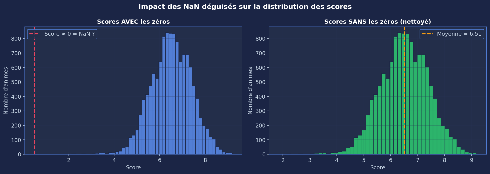
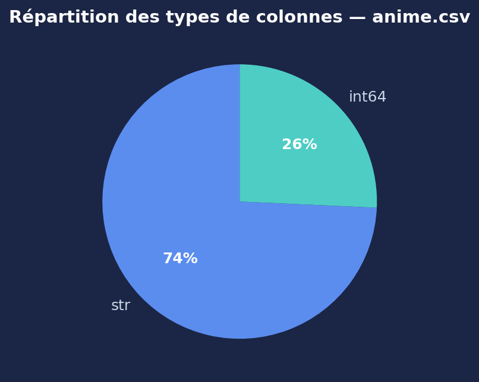
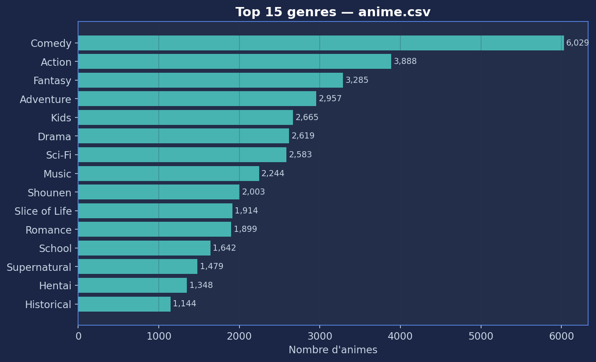
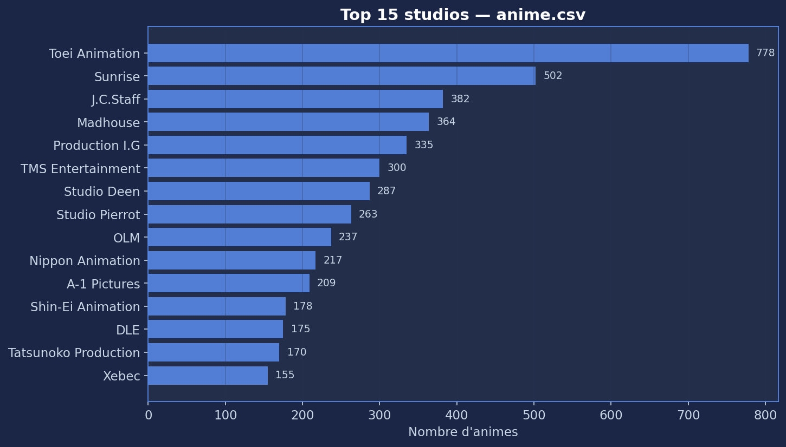
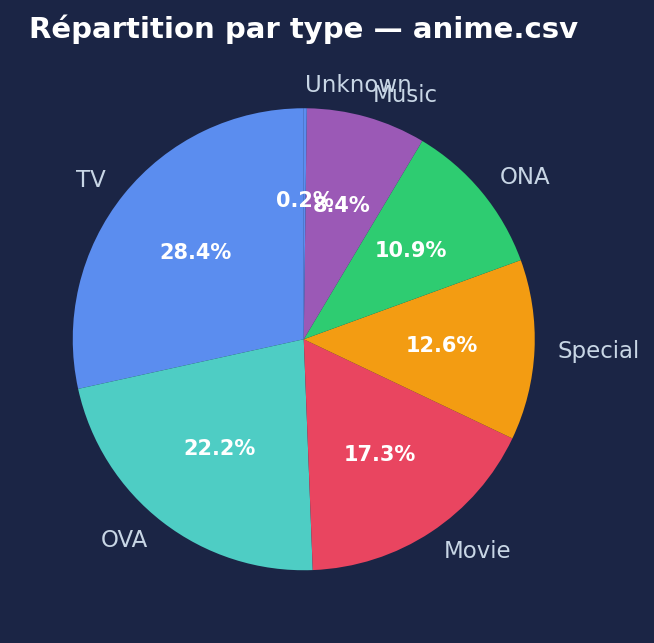
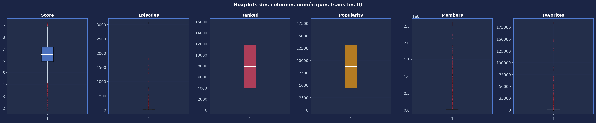
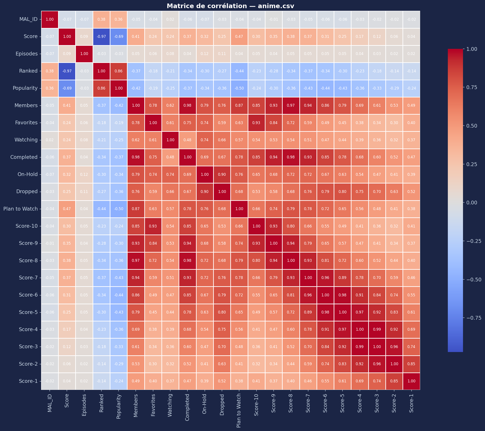

# Rapport d'audit (extrait terminal)

Source: `terminals/1.txt` (lignes 741-1022)

```text
romain@MacBook-Air-de-Romain anidata-lab % python3 airflow/dags/01_audit_complet.py

============================================================
  1. VÉRIFICATION DES FICHIERS
============================================================

  ✅ anime.csv (5.4 MB) — Informations générales sur les animes
  ✅ rating_complete.csv (780.0 MB) — Ratings des utilisateurs (animes complétés)
  ✅ anime_with_synopsis.csv (6.9 MB) — Synopsis textuels des animes

============================================================
  2. CHARGEMENT DES DONNÉES
============================================================

  Chargement de anime.csv...
  ✅ anime.csv : 17,562 lignes × 35 colonnes
  Chargement de anime_with_synopsis.csv...
  ✅ anime_with_synopsis.csv : 16,214 lignes × 5 colonnes
  Chargement de rating_complete.csv (échantillon 500 000 lignes)...
  Comptage du nombre total de lignes (peut prendre 1-2 min)...
  ✅ rating_complete.csv : 57,633,278 lignes au total (échantillon : 500 000)
  ℹ️  Mémoire utilisée par les DataFrames : 49.8 MB

============================================================
  3. AUDIT — anime.csv
============================================================


--- 3.1 Structure et types ---

  Colonnes (35) :
    • MAL_ID                    → int64
    • Name                      → object
    • Score                     → object
    • Genres                    → object
    • English name              → object
    • Japanese name             → object
    • Type                      → object
    • Episodes                  → object
    • Aired                     → object
    • Premiered                 → object
    • Producers                 → object
    • Licensors                 → object
    • Studios                   → object
    • Source                    → object
    • Duration                  → object
    • Rating                    → object
    • Ranked                    → object
    • Popularity                → int64
    • Members                   → int64
    • Favorites                 → int64
    • Watching                  → int64
    • Completed                 → int64
    • On-Hold                   → int64
    • Dropped                   → int64
    • Plan to Watch             → int64
    • Score-10                  → object
    • Score-9                   → object
    • Score-8                   → object
    • Score-7                   → object
    • Score-6                   → object
    • Score-5                   → object
    • Score-4                   → object
    • Score-3                   → object
    • Score-2                   → object
    • Score-1                   → object

--- 3.2 Valeurs manquantes ---
Empty DataFrame
Columns: [NaN, % NaN]
Index: []
  ✅ Aucune valeur manquante détectée (attention aux NaN déguisés !)

--- 3.3 Valeurs manquantes DÉGUISÉES ---
  ⚠️  Score : 5,141 valeurs suspectes ('Unknown', 'N/A', '-'...)
  ⚠️  Genres : 63 valeurs suspectes ('Unknown', 'N/A', '-'...)
  ⚠️  English name : 10,565 valeurs suspectes ('Unknown', 'N/A', '-'...)
  ⚠️  Japanese name : 48 valeurs suspectes ('Unknown', 'N/A', '-'...)
  ⚠️  Type : 37 valeurs suspectes ('Unknown', 'N/A', '-'...)
  ⚠️  Episodes : 516 valeurs suspectes ('Unknown', 'N/A', '-'...)
  ⚠️  Aired : 309 valeurs suspectes ('Unknown', 'N/A', '-'...)
  ⚠️  Premiered : 12,817 valeurs suspectes ('Unknown', 'N/A', '-'...)
  ⚠️  Producers : 7,794 valeurs suspectes ('Unknown', 'N/A', '-'...)
  ⚠️  Licensors : 13,616 valeurs suspectes ('Unknown', 'N/A', '-'...)
  ⚠️  Studios : 7,079 valeurs suspectes ('Unknown', 'N/A', '-'...)
  ⚠️  Source : 3,567 valeurs suspectes ('Unknown', 'N/A', '-'...)
  ⚠️  Duration : 555 valeurs suspectes ('Unknown', 'N/A', '-'...)
  ⚠️  Rating : 688 valeurs suspectes ('Unknown', 'N/A', '-'...)
  ⚠️  Ranked : 1,762 valeurs suspectes ('Unknown', 'N/A', '-'...)
  ⚠️  Score-10 : 437 valeurs suspectes ('Unknown', 'N/A', '-'...)
  ⚠️  Score-9 : 3,167 valeurs suspectes ('Unknown', 'N/A', '-'...)
  ⚠️  Score-8 : 1,371 valeurs suspectes ('Unknown', 'N/A', '-'...)
  ⚠️  Score-7 : 503 valeurs suspectes ('Unknown', 'N/A', '-'...)
  ⚠️  Score-6 : 511 valeurs suspectes ('Unknown', 'N/A', '-'...)
  ⚠️  Score-5 : 584 valeurs suspectes ('Unknown', 'N/A', '-'...)
  ⚠️  Score-4 : 977 valeurs suspectes ('Unknown', 'N/A', '-'...)
  ⚠️  Score-3 : 1,307 valeurs suspectes ('Unknown', 'N/A', '-'...)
  ⚠️  Score-2 : 1,597 valeurs suspectes ('Unknown', 'N/A', '-'...)
  ⚠️  Score-1 : 459 valeurs suspectes ('Unknown', 'N/A', '-'...)

--- 3.4 Doublons ---
  ✅ Aucun doublon exact
  ✅ Clé MAL_ID : toutes les valeurs sont uniques

--- 3.5 Statistiques descriptives (colonnes numériques) ---
         MAL_ID  Popularity     Members  Favorites   Watching   Completed    On-Hold    Dropped  Plan to Watch
count  17562.00    17562.00    17562.00   17562.00   17562.00    17562.00   17562.00   17562.00       17562.00
mean   21477.19     8763.45    34658.54     457.75    2231.49    22095.57     955.05    1176.60        8199.83
std    14900.09     5059.33   125282.14    4063.47   14046.69    91009.19    4275.68    4740.35       23777.69
min        1.00        0.00        1.00       0.00       0.00        0.00       0.00       0.00           1.00
25%     5953.50     4383.50      336.00       0.00      13.00      111.00       6.00      37.00         112.00
50%    22820.00     8762.50     2065.00       3.00      73.00      817.50      45.00      77.00         752.50
75%    35624.75    13145.00    13223.25      31.00     522.00     6478.00     291.75     271.00        4135.50
max    48492.00    17565.00  2589552.00  183914.00  887333.00  2182587.00  187919.00  174710.00      425531.00

--- 3.6 Valeurs aberrantes potentielles ---
  ⚠️  Members : 2,851 outliers (hors [-18994.9, 32554.1])
  ⚠️  Favorites : 3,055 outliers (hors [-46.5, 77.5])
  ⚠️  Watching : 2,781 outliers (hors [-750.5, 1285.5])
  ⚠️  Completed : 3,006 outliers (hors [-9439.5, 16028.5])
  ⚠️  On-Hold : 2,723 outliers (hors [-422.6, 720.4])
  ⚠️  Dropped : 2,927 outliers (hors [-314.0, 622.0])
  ⚠️  Plan to Watch : 2,718 outliers (hors [-5923.2, 10170.8])

--- 3.7 Colonnes catégorielles — valeurs uniques ---
  • Name                      → 17,558 valeurs uniques — Ex: Cowboy Bebop, Cowboy Bebop: Tengoku no Tobira, Trigun, Witch Hunter Robin, Bouken Ou Beet
  • Score                     → 533 valeurs uniques — Ex: 8.78, 8.39, 8.24, 7.27, 6.98
  • Genres                    → 5,034 valeurs uniques — Ex: Action, Adventure, Comedy, Drama, Sci-Fi, Action, Drama, Mystery, Sci-Fi, Space, Action, Sci-Fi, Adventure, Comedy, Drama, Action, Mystery, Police, Supernatural, D, Adventure, Fantasy, Shounen, Supernatura
  • English name              → 6,831 valeurs uniques — Ex: Cowboy Bebop, Cowboy Bebop:The Movie, Trigun, Witch Hunter Robin, Beet the Vandel Buster
  • Japanese name             → 16,679 valeurs uniques — Ex: カウボーイビバップ, カウボーイビバップ 天国の扉, トライガン, Witch Hunter ROBIN (ウイッチハンターロビン), 冒険王ビィト
  • Type                      → 7 valeurs uniques — Ex: TV, Movie, OVA, Special, ONA
  • Episodes                  → 201 valeurs uniques — Ex: 26, 1, 52, 145, 24
  • Aired                     → 11,947 valeurs uniques — Ex: Apr 3, 1998 to Apr 24, 1999, Sep 1, 2001, Apr 1, 1998 to Sep 30, 1998, Jul 2, 2002 to Dec 24, 2002, Sep 30, 2004 to Sep 29, 2005
  • Premiered                 → 231 valeurs uniques — Ex: Spring 1998, Unknown, Summer 2002, Fall 2004, Spring 2005
  • Producers                 → 3,783 valeurs uniques — Ex: Bandai Visual, Sunrise, Bandai Visual, Victor Entertainment, TV Tokyo, Bandai Visual, Dentsu, Victor , TV Tokyo, Dentsu
  • Licensors                 → 231 valeurs uniques — Ex: Funimation, Bandai Entertainment, Sony Pictures Entertainment, Funimation, Geneon Entertainment USA, Unknown, VIZ Media, Sentai Filmworks
  • Studios                   → 1,090 valeurs uniques — Ex: Sunrise, Bones, Madhouse, Toei Animation, Gallop
  • Source                    → 16 valeurs uniques — Ex: Original, Manga, Light novel, Game, Visual novel
  • Duration                  → 313 valeurs uniques — Ex: 24 min. per ep., 1 hr. 55 min., 25 min. per ep., 23 min. per ep., 27 min. per ep.
  • Rating                    → 7 valeurs uniques — Ex: R - 17+ (violence & profanity), PG-13 - Teens 13 or older, PG - Children, R+ - Mild Nudity, G - All Ages
  • Ranked                    → 10,490 valeurs uniques — Ex: 28.0, 159.0, 266.0, 2481.0, 3710.0
  • Score-10                  → 3,379 valeurs uniques — Ex: 229170.0, 30043.0, 50229.0, 2182.0, 312.0
  • Score-9                   → 3,645 valeurs uniques — Ex: 182126.0, 49201.0, 75651.0, 4806.0, 529.0
  • Score-8                   → 4,515 valeurs uniques — Ex: 131625.0, 49505.0, 86142.0, 10128.0, 1242.0
  • Score-7                   → 4,933 valeurs uniques — Ex: 62330.0, 22632.0, 49432.0, 11618.0, 1713.0
  • Score-6                   → 4,236 valeurs uniques — Ex: 20688.0, 5805.0, 15376.0, 5709.0, 1068.0
  • Score-5                   → 3,288 valeurs uniques — Ex: 8904.0, 1877.0, 5838.0, 2920.0, 634.0
  • Score-4                   → 2,235 valeurs uniques — Ex: 3184.0, 577.0, 1965.0, 1083.0, 265.0
  • Score-3                   → 1,506 valeurs uniques — Ex: 1357.0, 221.0, 664.0, 353.0, 83.0
  • Score-2                   → 1,110 valeurs uniques — Ex: 741.0, 109.0, 316.0, 164.0, 50.0
  • Score-1                   → 1,084 valeurs uniques — Ex: 1580.0, 379.0, 533.0, 131.0, 27.0

--- 3.8 Problèmes d'encodage potentiels ---
  ℹ️  3 colonne(s) contiennent des caractères non-ASCII (japonais, accents...) — normal pour ce dataset

============================================================
  4. AUDIT — anime_with_synopsis.csv
============================================================


--- 4.1 Structure ---
  16,214 lignes × 5 colonnes
  Colonnes : ['MAL_ID', 'Name', 'Score', 'Genres', 'sypnopsis']

--- 4.2 Valeurs manquantes ---
  ✅ MAL_ID : aucun NaN
  ✅ Name : aucun NaN
  ✅ Score : aucun NaN
  ✅ Genres : aucun NaN
  ⚠️  sypnopsis : 8 NaN (0.0%)

--- 4.3 Longueur des synopsis ---
  Colonne 'sypnopsis' :
    Longueur min    : 10 caractères
    Longueur max    : 3,047 caractères
    Longueur moyenne: 377 caractères

--- 4.4 Doublons ---
  ✅ Aucun doublon exact

============================================================
  5. AUDIT — rating_complete.csv (échantillon 500K)
============================================================


--- 5.1 Structure ---
  Total réel : 57,633,278 lignes
  Échantillon : 500,000 lignes × 3 colonnes
  Colonnes : ['user_id', 'anime_id', 'rating']

--- 5.2 Valeurs manquantes ---
  ✅ user_id : aucun NaN
  ✅ anime_id : aucun NaN
  ✅ rating : aucun NaN

--- 5.3 Distribution des ratings ---
  Colonne 'rating' (probable rating) :
    Min     : 1
    Max     : 10
    Moyenne : 7.55
    Médiane : 8.0

  Distribution :
       1 :   3,140
       2 :   3,306 █
       3 :   5,794 █
       4 :  12,082 ███
       5 :  29,330 █████████
       6 :  57,137 █████████████████
       7 : 113,461 ███████████████████████████████████
       8 : 127,303 ████████████████████████████████████████
       9 :  87,466 ███████████████████████████
      10 :  60,981 ███████████████████

--- 5.4 Utilisateurs et animes uniques ---
  • user_id              → 2,825 valeurs uniques
  • anime_id             → 11,300 valeurs uniques
  • rating               → 10 valeurs uniques

============================================================
  6. RAPPORT DE SYNTHÈSE
============================================================


Fichier            Lignes          Colonnes    NaN total
────────────────────────────────────────────────────────────
anime.csv              17,562       35               0
synopsis.csv           16,214        5               8
ratings.csv        57,633,278        3               0 (sur 500K)


--- Problèmes identifiés à traiter ---

  1. Valeurs manquantes classiques (NaN) dans anime.csv
  2. Valeurs manquantes DÉGUISÉES (score=0, 'Unknown' dans episodes...)
  3. Types de données incorrects (colonnes numériques stockées en texte)
  4. Caractères spéciaux dans les titres japonais/coréens
  5. Colonnes multi-valuées (genres, studios = listes dans une string)
  6. Outliers potentiels à vérifier avec la connaissance métier


--- Prochaines étapes ---

  → Mardi matin : Nettoyage + Feature Engineering (script 02_nettoyage.py)
  → Mardi après-midi : Indexation dans Elasticsearch + Grafana
  → Mercredi-Vendredi : Pipeline Airflow pour automatiser tout ça


✅ Audit terminé avec succès !
Les résultats ci-dessus constituent votre rapport d'audit.
Copiez-collez la sortie dans un fichier texte pour le conserver.
```

## Graphiques d'audit

Les graphiques générés par `02_audit_visuel.py` sont disponibles ci-dessous.

### 1) Distribution des scores


### 2) Types de données


### 3) Top genres


### 4) Top studios


### 5) Répartition par type


### 6) Boxplots


### 7) Matrice de corrélation

